[Back to Home](../index.html)

# Domain One

**Attacks, Threats, and Vulnerabilities**

_Percentage of Examination_: 24%

***

##### Subdomains

| Subdomain | Description                                                                                          |
|:----------|:-----------------------------------------------------------------------------------------------------|
| 1.1       | [Compare and contrast different types of social engineering techniques.](#subdomain-11)              |
| 1.2       | [Given a scenario, analyze potential indicators to determine the type of attack.](#subdomain-12)     |
| 1.3       | [Given a scenario, analyze potential indicators associated with application attacks.](#subdomain-13) |
| 1.4       | [Given a scenario, analyze potential indicators associated with network attacks.](#subdomain-14)     |
| 1.5       | [Explain different threat actors, vectors, and intelligence sources.](#subdomain-15)                 |
| 1.6       | [Explain the security concerns associated with various types of vulnerabilities.](#subdomain-16)     |
| 1.7       | [Summarize the techniques used in security assessments.](#subdomain-17)                              |
| 1.8       | [Explain the techniques used in penetration testing.](#subdomain-18)                                 |

_Note:_ Terms below marked with an asterisk (*) may not be explicitly included in the SY0-601 exam objectives, but are still important and relative to the course material.

_Second Note: Any scripts or other information given in these notes are intended for educational purposes only, and unauthorized use for malicious purposes is illegal and unethical._

***

## Subdomain 1.1
###### [Back to Top](#top)

_Compare and contrast different types of social engineering techniques._

**The act of gathering info on an attack by taking advantage of the weakest part of security: _people_.**


#### Phishing

* A form of social engineering where attackers deceive people into revealing sensitive information or installing malware such as ransomware.
* Often delivered through email, text, etc.
* Often noticeable issues with spelling, fonts, graphics.

#### Smishing

* Phishing via SMS, mass text messages sent to users asking for sensitive information or encouraging them to visit a fake website.
* Spoofing is generally an issue.
* Will receive SMS with unsuspecting link or asks for personal information from the victim.

#### Vishing

* A special type of phishing that uses Voice over IP (VoIP).
* Caller ID spoofing is common in this scenario.
* Calls received can include fake security checks or ask the victim to update personal information for a business or service.

#### Spam


* A form of unsolicited messages in the form of email, forums, etc. with various content including commercial advertising, non-commercial proselytizing, and phishing attempts.

#### Spam over instant messaging (SPIM)

* Spam that is delivered through instant messaging.

#### Spear phishing

* A phishing expedition in which the emails are carefully designed to target specific groups or organizations.

#### Dumpster diving


* Searching the garbage collection area or dustbin to look for non-shredded confidential documents
* Timing can be important - End of month, end of quarter. Based on pickup schedule.
* Protect trash - locks on dumpsters, shred confidential documents. Governments burn documents.

#### Shoulder surfing


* This is a social engineering attack in which the attackers obtain confidential information by looking over someone's shoulder to read what is on their computer screen or phone or to observe what they are typing.
* Can be in public areas such as airports and coffee shops.
* Can be done from afar using binoculars or through monitoring webcams.
* Prevent by using privacy filters, keep monitor out of sight, and be aware of your surroundings.

#### Pharming

* Traffic redirection to a Web site that looks identical to the intended website in order to capture the victim's PII/login credentials.
* Difficult for anti-malware to stop as everything seems legit for the unsuspecting users.
* Can use poisoned DNS server or client vulnerabilities.

#### Tailgating


* Gaining unauthorized access to restricted areas by following another person.
* Most security stops at the border so once inside, there is generally not much to stop the perpetrator.

#### Eliciting information

* The act of extracting information from the victim.
* "Hacking the human,"
* Well-documented psychological techniques.

#### Whaling

* A type of phishing targeted at high-level personnel such as senior executives.
* CFO or other executives targeted through phishing or other methods.
* Executives generally have direct access to corporate banking.

#### Prepending

* An attacker adds a term or phrase to the header of an email to enhance its effectiveness as a social engineering attack.
* Example: `https://mmicrosoft.com`

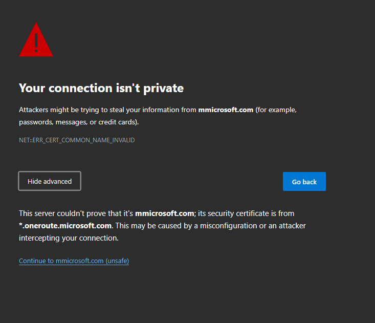

#### Identity fraud

* The use of one person of another person's personal information, without authorization, to commit a crime or to deceive or defraud that other person or a third person.
* Credit fraud - open an account under your name or take your credit card information.
* Bank fraud - opens an account under your name or gains access to your bank account.
* Loan fraud - Your personal information is used for a loan/lease.
* Government benefits fraud - Attacker claims benefits using your identity.
* Always verify before giving away information to another individual or organization. Don't give out passwords or disclose personal details.

#### Invoice scams


* When an attacker sends a fake invoice to a business for something such as a domain renewal, toner cartridges, etc., and states the invoice is from the CEO. The business may pay the invoice since it looks like it is coming from a legitimate source.
* Invoice looks like a legitimate one requesting printing services, lawn work, etc.
* Might also include a link to make the payment which the attacker can use to gain payment details.

#### Credential harvesting

* The process of collecting login credentials. May deploy malware on unsuspecting users to achieve goals.
* Macros may download credential-harvesting software through emails containing attachments.
* Victim generally clueless as harvesting happens in the background.

#### Reconnaissance


* Gathering information on a victim. Gathers background information to build a believable pretext.

#### Hoax

* A threat that does not actually exist, is often in the form of an email, and still often consumes excessive resources.
* Hoax is often spread through email or social media.
* Some will take your money or waste as much time investigating it as if it were a legitimate issue.
* Spam filters can help
* Cross reference with others de-hoax sources such as hoax-slayer.net.

#### Impersonation


* An attacker who pretends to be someone else in the hopes of eliciting Personally Identifiable Information (PII).
* May use details gathered from reconnaissance - they know your place of work, bank, etc.
* Attacker may try and be chummy to lower the victim's guard.
* Attacker may also try to act like a superior and pull rank.

#### Watering hole attack

* A malicious attack that is directed toward a small group of specific individuals who visit the same website.
* Site determination may be educated guess such as local eateries or industry related websites.
* Watch the watering hole by using defense-in-depth, deploy firewalls and IPS, ensure anti-malware signature updates are continuously deployed.

#### Typosquating

* A type of URL hijacking where there is a site with URLs that are slightly different from a legitimate source.
* Example: `https://microsoftt.com`

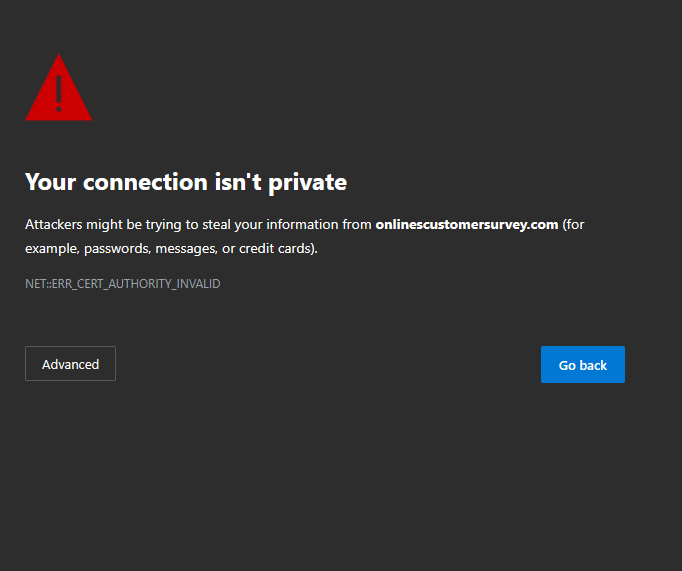

#### Pretexting

* A social engineering tactic that involves creating a false pretext or scenario to trick someone into divulging sensitive information.
* Attacker would claim information is needed to rectify some issue - if a user or employee falls for the false pretext, they would unwittingly hand over their login credentials or personal information to the attacker who could then use them to gain unauthorized access to the company's network or sensitive data, or personal information to access a banking site or other service.
* Actor is a character in a scenario they create - "Hello, this is account services with XYZ. We want to confirm your banking information..."

#### Influence Campaigns
_Usually nation-state actors that divide, distract, persuade and sway public opinion on political and social issues._


##### Hybrid Warfare

* Originally a military strategy - a broad description of techniques to wage war non-traditionally.
* With the dawn of the internet and cyberwarfare, it includes instilling fake news to complete goals such as influencing foreign elections.

##### Social Media

* When a threat actor creates fake accounts, creates content on those fake accounts to seem legitimate, post on social media using these fake accounts, amplify message, real users share the message, and then mass media picks up the story.

#### Principles -reasons for effectiveness
_Principles of Social Engineering and their reasons for effectiveness._


##### Authority

* To impersonate or imply a position of authority.
* Attacker will impersonate someone such as a police officer or Help Desk employee to try and spoof you into giving away information.

##### Intimidation

* To frighten by threat.
* "If you don't get me the credentials for that server, the whole thing will go down..."

##### Consensus

* Influence a victim by what others do; everyone else does it!
* "Well Bill who works with you did this for me before..."

##### Scarcity

* To describe a lack of something.
* Limited resources or time to act.
* "We need to act before we run out..."

##### Familiarity

* To imply a closer relationship or someone who is well known.
* "Common friends" or someone you know. "Hey it's me, Bill's third cousin Franklin..."

##### Trust

* To assure reliance on their honesty and integrity.
* Gain their confidence, become their friend.
* "I'm from the Help Desk and I'm here to assist..."

##### Urgency

* To call for immediate action.
* Rush the victim, cause them not to think.

***

## Subdomain 1.2
###### [Back to Top](#top)

_Given a scenario, analyze potential indicators to determine the type of attack._

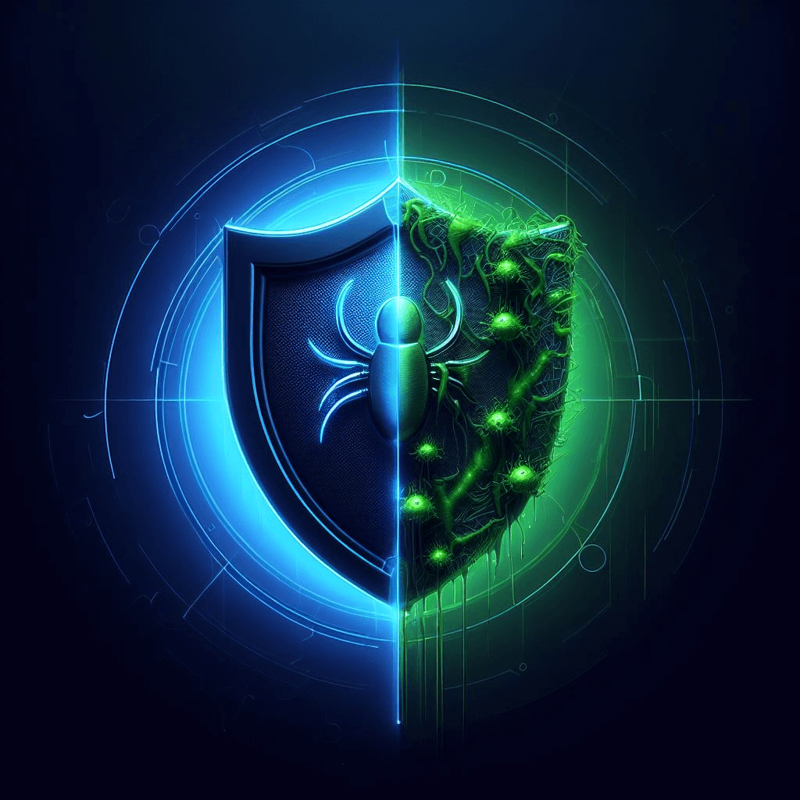

#### Malware
_Malicious software. Intended to damage or disable computers and computer systems._

##### Ransomware

* Type of malware that is designed to block access to a computer system until a sum of money is paid.
* Can spread through phishing email or unknowingly/knowingly infected website.
* May or may not be able to be removed by a security professional without paying the sum of money to the attacker.
* Protect against this threat by keeping backups of your computer, keeping your OS and software patched and up-to-date, and keeping anti-malware signatures up to date.

##### Trojans


* A type of malware that pretends to be a useful program while secretly performing another function.
* Users may download and install what they believe to be legitimate software without realizing that a Trojan horse will also be installed.
* Circumvents existing security - some may even be built to disable anti-virus software.
* To protect against this threat, don't run unknown software, keep anti-malware signatures up-to-date, and keep backups!

##### Worms

* A self-replicating program or algorithm that consumes system resources and can spread through networks, emails, and messages.
* This form of malware can take over many systems quickly.
* Firewalls and IDS/IPOS can mitigate infestations but can't help much once the worm is on the inside.

1. Infected computer searches for a vulnerable system.
2. Vulnerable computer is exploited.
3. Backdoor is installed and downloads worm.

##### Potentially unwanted Programs (PUPs)

* A form of software that is often unsuspectingly installed with other software and is normally undesirable.
* Examples of this would be an overly aggressive browser toolbar, a backup utility that displays ads, or a browser search engine hijacker.

##### Fileless virus


* A virus that does not save as a file on the computer directly; instead, it operates in memory and is never installed.

Example:
1. User clicks on malicious website link.
2. Website exploits a flash/Java/Windows vulnerability.
3. Launches PowerShell and downloads payload in RAM.
4. Runs scripts and executables in memory, exfiltrates data, damages files.
5. Adds an auto-start to registry.

##### Command and control

* A server or computer controlled by an attacker or cybercriminal which is used to send commands to systems compromised by malware and receive stolen data from a target network.
* Many campaigns have been found using cloud-based services, such as webmail and file-sharing service - allows C&C servers to blend in with normal traffic and avoid detection.
* Also serve as the headquarters for compromised machines in a botnet.

##### Bots

* A bot, short for robot, is a type of software application or script that performs automated tasks on command.
* Bots generally perform malicious tasks that allow an attacker to remotely take control over an affected computer.
* Are generally part of a larger entity called a botnet and controlled through a Command and Control server or C&C.

##### Botnet*


* A botnet, short for robot network, is a group of compromised computers or mobile devices connected to a network and managed using a C&C server.
* As they infect newer technologies such as Internet of Things (IoT) devices in homes, public spaces, and secure areas, even more unsuspecting users can be put at risk. This is due to the lack of security on these open-source and generally unprotected devices.
* Compromised devices within a botnet can be controlled to perform a variety of actions, not limited to Distributed Denial of Service (DDoS) attacks, relay spam, proxy network traffic, and other distributed computing tasks.

##### Cryptomalware

* A newer generation of ransomware.
* Where malware encrypts your data files (pictures, documents, movies, music, etc.) Your OS remains available as they want you running, but not working.
* Pay a ransom and your data will be returned.

##### Logic bombs


* Malicious code objects that infect a system and lie dormant until they are triggered by the occurrence of one or more conditions such as time, program launch, website logon, and so on.
* Difficult to identify and difficult to recover if it goes off.

##### Spyware

* A software application that is secretly placed on a user's system to gather information and relay it to outside parties (host machine).
* They are generally difficult to recognize as each is unique and does not have a predefined signature.
* Can be prevented through process and procedures, electronic monitoring such as host-based intrusion detection, and constant monitoring from administrators.

##### Keyloggers

* Malware that capture keystrokes from keyboards.
* Keylogger applications may also capture other input like mouse movement, touchscreen inputs, or credit card swipes from attached devices.

##### Remote Access Trojan (RAT)

<br>

* Provides the attacker with remote control of a victim computer and is the most commonly used type of Trojan.
* A remote administration tool; the ultimate backdoor.
* Attacker connects with client software and and then controls the device for keylogging, screen recording or collecting screenshots, copy files, or embed even more malware.
* Don't install unknown software, keep anti-malware signatures updated, and always backup!

##### Rootkit

* A set of software tools that enable an unauthorized user to gain control of a computer without being detected.
* Modifies the core system files; invisible to the OS and traditional anti-virus utilities.
* Make sure to look for the unusual and perform anti-malware scans. Use a remover specific to the rootkit which are normally built after the rootkit is discovered. Secure boot with UEFI which is additional security embedded in the BIOS.

##### Backdoor

* Gives access to a computer, program, or service that circumvents normal security to give program access.
* Often placed on a computer through malware.
* Some software include a backdoor; bad software can have a backdoor as part of the app.

#### Password attacks

_Malicious ways hackers attempt to gain access to an account. A common attack vector used to bypass or exploit authentication of user accounts. Include several different techniques._


##### Spraying

* Attack an account with the top three (or more) common passwords - if they don't work, move on to the next account.
* No lockouts, no alarms, no alerts.
* Can be found commonly where the application or admin sets a default password for new users.

##### Dictionary

* An attack that compares passwords against common words in a dictionary of words - usually from wordlists that can be found on the internet.
* They can take quite a bit of time but can go on to find the hashes associated with the cracked passwords using this attack.
* Password crackers can substitute letters for numbers or symbols (i.e. pa$$w0rd.)
* Example software: [Cain and Abel](https://en.wikipedia.org/wiki/Cain_and_Abel_(software))

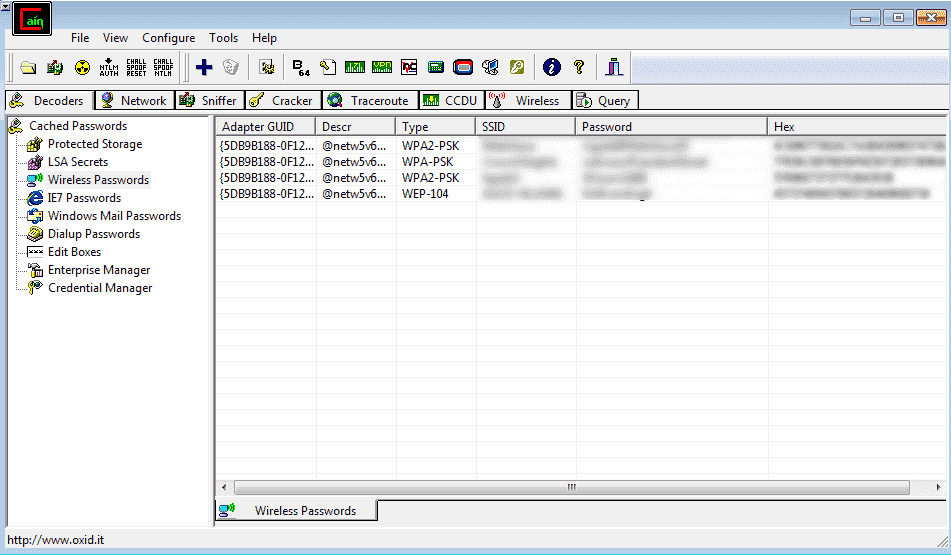

##### Brute force

* This type of attack sees the threat actor try every possible password combination until a hash is matched.
* This might take some time - a strong hashing algorithm can slow things down.
* Online: keep trying the login process; very slow as most accounts will lockout after a number of failed attempts.
* Offline: Obtain a list of users and hashes; calculate a password hash, compare to a stored hash. Large computational resource requirement.

##### Rainbow table

* Lists of common passwords and the value they hash to.
* An optimized, pre-built set of hashes that saves time and storage space and contains pre-calculated hash chains.
* Has a remarkable speed increase, especially with longer password lengths.

_Example of a rainbow table using MD5 hash._

  | hash_hash                        | hash_id | hash_word |
  |:---------------------------------|:--------|:----------|
  | 0cc175b9c0f1b6a831c399e269772661 | 1       | a         |
  | 92eb5ffee6ae2fec3ad71c777531578f | 2       | b         |
  | 4a8a08f09d37b73795649038408b5f33 | 3       | c         |
  | ...                              | ...     | ...       |
  | 02129bb861061d1a052c592e2dc6b383 | 50      | X         |
  | 57cec4137b614c87cb4e24a3d003a3e0 | 51      | Y         |
  | 21c2e59531c8710156d34a3c30ac81d5 | 52      | Z         |
  

##### Plaintext/unencrypted

* A rare scenario when a threat actor is able to locate passwords stored "in the clear" - no encryption.
* If an application is seen storing passwords as plaintext - get rid of this application!

##### _Note: Regarding Hash and Salt_


See [subdomain 2.8](https://jhumphreys.github.io/security_plus/domains/domain_two.html#subdomain-28)

#### Physical attacks

_A type of security attack that involves the use of physical devices to gain authorized access to a system or network. Can be in many forms, including malicious USB cables, flash drives, skimming, and card cloning._

##### Malicious Universal Serial Bus (USB) cable

* Physical attack where a seemingly harmless USB cable has additional electronics inside to pose as a keyboard/mouse or other Human Interface Device (HID)
* Once connected, the cable takes over and installs malicious software.
* Can be prevented by only using trusted hardware.

##### Malicious flash drive


* Physical attack where a flash drive is loaded with malicious files (MS Office docs, PDF files) and documents or acts as a HID (Human Interface Device) or another device such as an Ethernet adapter in order to hijack information.
* Older operating systems would just run the drive automatically - this is no longer the case.
* Can be prevented by only using trusted flash drives.

##### Card cloning

* Physical attack where card details are compromised and placed on a duplicate card, often included with the printed CVC (Card Validation Code).
* The card magnetic stripe is duplicated but the chip cannot be cloned.
* Card details are generally cloned by a skimmer.
* Cloning gift cards are common as they use magnetic stripe technology.

##### Skimming


* Physical attack where a device is installed over hardware that reads credit or debit cards and captures the information from the cards magnetic swipe - card number, expiration date, card holder's name.
* May also be used in conjunction with a camera to record PIN information.
* Always physically check before using card readers or ATM terminals.

#### Adversarial artificial intelligence (AI)


* Machine learning: Computers identify patterns in data which in turn further improve their predictions. This requires an ample and continuous quantity of training data. It's in use everyday in a variety of products including email (anti-spam), websites (recommend products), and prevent car accidents (automatic breaks, self-driving).
* Poisoning of the training data: Confuse AI. Attackers can feed the AI modified training data to cause it to behave incorrectly.
* Evasion attacks: AI only as good as training data and attackers will find holes and limitations. AI that may be trained to fight spam may have an attacker try words that the AI does not treat as bad and allow through.
* Secure: Check and crosscheck training data. Constantly retrain the AI with new data, more data. Train the AI with the poisoned data - let the AI know what it is up against.

##### Tainted training data for machine learning (ML)

* When attackers send modifying training data that causes the AI to behave incorrectly - confuse the artificial intelligence.

##### Security of machine learning algorithms

* Actions to take to constantly retrain, cross check, and verify AI training data with new data, more data, and better data to prevent AI poisoning.
* It may also be plausible to train the AI with possible poisoning data so the AI knows what to look out for.

#### Supply-chain attacks


* Attacks that focus on weaker links in an organization's supply chain.
* An attacker will find an exploit to infect the entire chain through a third-party supplier.
* People trust their suppliers...

#### Cloud-based vs. on-premises attacks

* Attackers want data no matter where it is.
* When it comes to cloud-based security, it is centralized and can cost less as it requires no dedicated hardware or data center to secure - a third-party handles that.
* With on-premises, the security burden is placed on the client and requires data center security and infrastructure costs.

#### Cryptographic attacks

_You now have encrypted the data and sent it to another person - is it secure? These attacks focus on finding ways to undo security and locate cryptographic shortcomings._

##### Birthday


* This attack will generate multiple versions of plaintext to match the hashes and find collision through brute force.
* Exploits the mathematics behind the [birthday problem in probability theory](https://en.wikipedia.org/wiki/Birthday_attack). This problem asks for the probability that, in a set of _n_ randomly chosen people, at least two will share a birthday.
* You can help protect yourself by using a large hash output size. 🧂

##### Collision

* Hash digests are _supposed_ to be unique, and different input data should never create the same hash.
* However, with previous hashing algorithms there is a cryptographic attack that exploits collisions in these hashes.
* Example: [SHAttered attack](https://debugpointer.com/security/collision-attack#:~:text=Perhaps%20one%20of%20the%20most%20well-known%20examples%20of,expedited%20the%20move%20towards%20more%20secure%20hash%20functions.). Researchers were able to find a collision in the SHA-1 hash function. This quickly led to an expedited move towards more secure hash functions.

##### Downgrade

* An attack that forces a system to rollback it's security in order to carry out an exploit.
* An [example of this flaw was](https://en.wikipedia.org/wiki/Downgrade_attack) found in OpenSSL that allowed the attacker to negotiate down to a lower version of TLS between the client and server. This is the is on of the most common types of downgrade attacks.

***

## Subdomain 1.3
###### [Back to Top](#top)

_Given a scenario, analyze potential indicators associated with application attacks._


#### Privilege escalation

* Gaining access to files you should not have permission to on a valid account via exploitation of a vulnerability.
* Usually access is of highest level and is of great concern.
* Can include horizontal privilege escalation where an attacker gets access to another credential on the network with higher privileges than the initial one used to gain their foothold.
* Make sure to patch software and OS as well as ensure anti-malware signatures are up to date. Also practice Data execution prevention.

#### Cross-site scripting (XSS)


* XSS is an injection vulnerability that occurs when an attacker can insert unauthorized JavaScript, VBScript, HTML, or other active content into a webpage.
* When other users view the page, the malicious code executes and affects or attacks the user.
* Malicious script can hijack the user's session, submit unauthorized transactions on the user's behalf, steal confidential information, or deface the page.
* Example:
  1. `https://fakewebsite.com/status?message=All+is+well`
  2. Application receives data in an HTTP request that includes data within the immediate response in an unsafe way. Response contains the following HTML code:
     
     ```html
     <p>Status: All is well.</p>
     ```
     
  3. An attack can craft a URL that includes malicious JavaScript code in the message parameter, which will be executed by the victim's broswer when they visit the URL

#### Injections

_A process where an attacker supplies untrusted input to a program, which gets processed by an interpreter as part of a command or query._


##### Structured query language (SQL)

* Web security vulnerability that allows an attacker to interfere with the queries that an application makes to its database.
* Attacker injects malicious SQL code into the applications input fields, which can then be executed by the database.
* Can lead to unauthorized access to sensitive data, data loss, or even complete system compromise.
* Example:
  1. Suppose a web app uses an SQL database to store user info. The application has a login page that accepts a username and password. SQL query to authenticate the user might look like this:
     
     ```sql
     SELECT * FROM users WHERE username = 'username' AND password = 'password'
     ```
     
  2. An attacker can exploit this by entering the following string as the username:
     
     ```sql
     ' OR 1=1 --
     ```
  3. This will modify the SQL query to look like this:

     ```sql
     SELECT * FROM users WHERE username = ' ' OR 1=1 --' AND password = 'password'
     ```
     
  4. The `--` at the end of the string is used to comment out the rest of the original query. The modified query will return all rows from the `users` table, effectively bypassing authentication.
  
##### Dynamic-link library (DLL)

* A technique used for running code with the address space of another process by forcing it to load a dynamic-link library.
* DLL injection is often used by external programs to influence the behavior of another program in a way it's authors did not anticipate or intend.
* Example of a simple injection in C++:

  ```c++
  #include <windows.h>
  #include <stdio.h>

  int main(int argc, char **argv) {
    if (argc != 3) {
        printf("Usage: %s <PID> <DLL_PATH>\n", argv[0]);
        return 1; }

    DWORD pid = atoi(argv[1]);
    HANDLE hProcess = OpenProcess(PROCESS_ALL_ACCESS, FALSE, pid);
    if (!hProcess) {
        printf("Failed to open process %d\n", pid);
        return 1;
    }

    LPVOID lpRemoteString = VirtualAllocEx(hProcess, NULL, strlen(argv[2]) + 1, MEM_COMMIT, PAGE_READWRITE);
    if (!lpRemoteString) {
        printf("Failed to allocate memory in remote process\n");
        return 1;
    }

    if (!WriteProcessMemory(hProcess, lpRemoteString, argv[2], strlen(argv[2]) + 1, NULL)) {
        printf("Failed to write memory in remote process\n");
        return 1;
    }

    HMODULE hKernel32 = GetModuleHandle("kernel32.dll");
    FARPROC pLoadLibraryA = GetProcAddress(hKernel32, "LoadLibraryA");

    HANDLE hThread = CreateRemoteThread(hProcess, NULL, 0,
                                         (LPTHREAD_START_ROUTINE)pLoadLibraryA,
                                         lpRemoteString,
                                         0,
                                         NULL);
    if (!hThread) {
        printf("Failed to create remote thread\n");
        return 1;
    }

    WaitForSingleObject(hThread, INFINITE);

    VirtualFreeEx(hProcess, lpRemoteString, strlen(argv[2]) + 1, MEM_RELEASE);
    CloseHandle(hThread);
    CloseHandle(hProcess);

    return 0; }
  ```

##### Lightweight Directory Access Protocol (LDAP)

* A technique used to exploit web applications which could reveal sensitive information or modify information represented in the LDAP data stores.
* It exploits a vulnerability in an application by manipulating input parameters passed to internal search, add or modify functions.
* When an application fails to properly sanitize user input, it is possible for an attacker to modify a statement.
* Example:
  1. Suppose an application uses the following LDAP query to authenticate a user:

  ```ldap
  (&(uid=admin)(userPassword=pass))
  ```

  2. An attacker could inject malicious code into the query by entering the following string as the username:
 
  ```ldap
  *)(uid=*))(|(uid=*
  ```

  3. This would result in the following LDAP query:
 
  ```ldap
  (&(uid=*)(uid=*))(|(uid=*)(userPassword=pass))
  ```

  4. An attacker could then use this query to bypass authentication and gain access to sensitive data.

##### Extensible Markup Language (XML)

* A web security vulnerability that allows an attacker to manipulate or compromise the logic of an XML application or document.
* It occurs when user input is not properly validated or sanitized before being added to an XML document or query.
* As with other injection attacks, it is important to validate all input data and sanitize it before processing it. For XML it is recommended to disabled external entities in XML parsers and use whitelisting instead of blacklisting.

#### Pointer/object deference

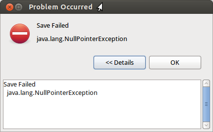

* A pointer is a variable that stores memory addresses of another variable.
* A null pointer is a pointer that does not point to any memory location.
* A dangling pointer that points to a memory location that has been freed or deleted.
* An object reference is a reference to an object in memory.
* A null pointer reference occurs when the application dereferences a pointer that it expects to be valid, but is null, typically causing a crash or exit.
* Most null pointer issues result in general software reliability problems, but if an attacker can intentionally trigger a null pointer dereference, the attacker might be able to use the resulting exception to bypass security logic or to cause the app to reveal debugging information that will be valuable in planning subsequent attacks.
* Can also be used to cause a Denial of Service (DoS) attack.

#### Directory traversal

* Method of accessing unauthorized directories by moving through the directory structure on a remote server.
* This can be done by manipulating input parameters used by the application to access files and directories.
* Example URL that could be used in a directory traversal attack:

  `http://example.com/download.php?file=../../../etc/passwd`

  1. In this example, the attacker is trying to access the `etc/passwd` file, which is typically only accessible by the root user.
* To prevent these attacks, it is important to validate user input and sanitize file paths.

#### Buffer overflows

* Overwriting a buffer of memory that spills into other memory areas.
* Can lead to unpredictable behavior including crashes, data corruption, and even remote code execution.
* Example of a buffer overflow in C programming:

```C
#include <stdio.h>
#include <string.h>

int main(int argc, char **argv) {
    char buffer[16];
    strcpy(buffer, argv[1]);
    printf("Buffer contents: %s\n", buffer);
    return 0;
}
```
  1. In this example, the `strcpy` function is used to copy the contents of `argv[1]` into `buffer`. If `argv[1]` contains more than 16 characters, the excess characters will overwrite adjacent memory locations.
  2. This can be exploited by attackers to execute arbitrary code or crash the program.


#### Race conditions

* A situation that occurs when two or more threads or processes access shared data and try to modify it at the same time, leading to unexecpted results.
* It is a common problem in multithread applications and multi-process systems.
* Suppose we have two threads, **Thread 1** and **Thread 2**, that are trying to access a shared variable **x**. **Thread 1** is responsible for setting the value of **x** to **10**, while **Thread 2** is responsible for printing the value of **x**. The following code snippet shows how this can be done:

```java
// Thread 1
x = 10;

// Thread 2
print(x);
```

  Assume that **Thread 2** starts executing before **Thread 1** and prints the value of **x** as **0**. This happens because the default value of an integer variable in Java is **0**, and **Thread 2** reads the value of **x** before it is set by **Thread 1**.
* To avoid race conditions, it is necessary to use synchronization mechanisms such as locks or semaphores to ensure that only one thread can access the shared data at any given time.

##### Time of check/time of use

* A type of software bug caused by a race condition involving the checking of the state of a part of a system and the use of the results of that check.
* This can happen when shared resources such as files, memory, or even variables in multithread programs
* The name "time of check to time-of-use" refers to the period between the time when a given resource is checked and the time that resource is used.
* A TOCTOU race condition occurs when between these two times, a change occurs in the resource to invalidate the results of the check.
* Weakness can be security relevant when an attacker can influence the state of the resource between check and use.
* Common in Unix systems, where they can be exploited to gain elevated privileges.

#### Error handling

* Dealing with errors that occur when the programs are running and communicating the response to the software developer and the user.
* Validate data (test for completeness, test for data type - valid data); don't allow system to crash; change color or textbox with errors.
* Improper error handling can lead to security vulnerabilities in applications and websites.
* For instance, error messages that provide clues about how an application or website operates can be used by attackers to break into secured areas.
* An example of error handling in JavaScript:

  ```js
  try {
    // Code that might throw an error
  } catch (error) {
    // Code to handle the error
  }
  ```

  The `try` block contains the code that might throw an error. If an error is thrown, the `catch` block will execute, and the `error` object will contain information about the error. You can then use this information to handle the error appropriately.

#### Improper input handling

* Invalid input that is accepted and used maliciously, causing attacks such as SQL injections, buffer overflows, denial of service, etc.
* Occurs when the software receives input or data, but it does not validate or incorrectly validates that the input has the properties are required to process the data safely and correctly. This can lead to parts of the system receiving unintended input.
* An example of this is when a web application exposes a function `showInfo()` that accepts parameters `name` and `template` from the user and opens a file based on this input. If the application does not validate the input properly, an attacker can craft the input in a form that is not expected by the rest of the application.

#### Replay attack

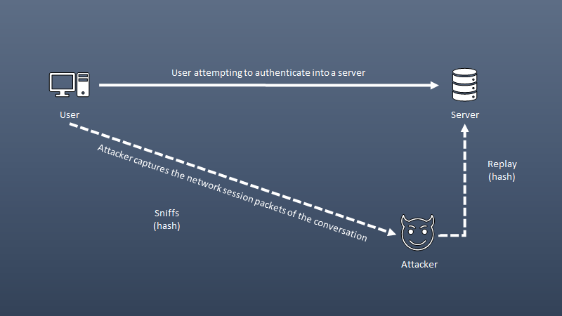

* An attack where an intruder records the communication between the user and a server, and later plays the recorded information back to impersonate the user. This is **NOT** an on-path attack as this does not require the original workstation.
* Network tap, ARP poisoning, malware are some of the methods used to achieve this.

##### Session replays

* When the client is first assigned to the server, the user is given a session ID (usually in the form of cookies.) Instead of constantly signing in, the user can access the server using the session ID
* If an attacker intercepts the session ID, then they will be able to log in as the client and access the server.

#### Integer overflow

* Is where a large number might be placed into a smaller section of memory - and that extra space needs to go somewhere - and usually it goes into an area of memory that is overflowed.
* This can lead to unexpected results, such as the program crashing (DoS) or producing incorrect output.
* For instance, in C programming, the `int` data type is typically used to store integers. The maximum value that can be stored in 32-bit `int` is 2,147,483,647. If you try to store a larger number than this in an `int`, an integer overflow will occur. For example, if you add at least 1 to the maximum value of an `int`, the result will be -2,147,483,648 instead of -2,147,483,648.

#### Request forgeries

_A type of malicious exploit of a website or web application where unauthorized commands are submitted from a user that the web application trusts. There are two types of request forgeries: cross-site request forgeries (CSRF) and server-side request forgeries (SSRF).

##### Server-side

* An attacker finds a vulnerable web application - generally caused by bad programming - and communicates to a web server and sends a request that controls a web application. The web server sends a request to another service, such as cloud file storage. Cloud storage sends response to the web server. Web server forwards response to the attacker.

##### Cross-site

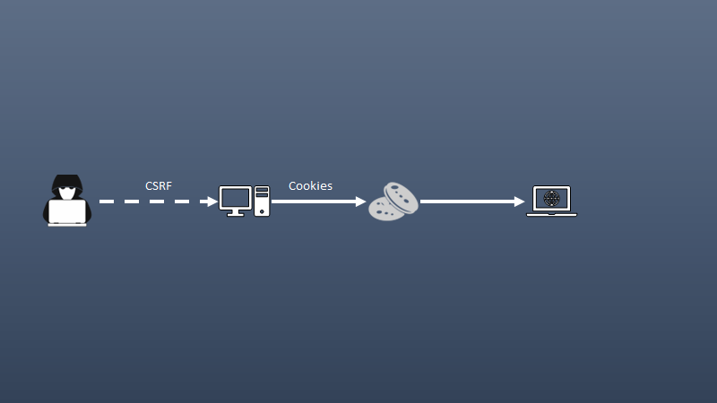

* One-click attack, session riding (XSRF, CRSF(see surf)). Takes advantage of the trust that a web application has for a user.
* For instance, web site trusts your browser. Requests are made without your consent or your knowledge - attacker posts Facebook status on your account.

#### Application programming interface (API) attacks

* Attackers look for vulnerabilities in this new communication path - exposing sensitive data, DoS, intercepted communication, privileged access.
* For example, an attacker can launch am API injection attack by injecting malicious code into an application that does not follow secure coding practices. This can lead to unauthorized access to resources and data, such as SQL injection, JSON injection, and cross-site scripting (XSS).
* To prevent API attacks, it is important to implement security measures such as authentication and authorization mechanisms, rate limiting, and input validation.

#### Resource exhaustion

* Occurs when applications are allowed to operate in an unrestricted and unmonitored manner so that all available system resources are consumed in the attempt to serve the requests of valid users or in response to a DoS attack.
* Some examples would be a ZIP bomb, DHCP starvation.

#### Memory leak

* Memory which is allocated, but never deallocated (or freed) by the program
* Example of a memory leak in C:

```C
void g () {
  int* ptr = (int*)malloc(sizeof(int));
  ptr = (int*)malloc(sizeof(int));
  return;
}
```
  `g()` allocates the memory on the heap using `malloc`, but assigns a new value to `ptr` without freeing previously allocated memory. This means that every time `g()` is called, it will allocate more memory on the heap, leading to a memory leak.
* Memory leaks can occur in any programming language that allows dynamic allocation memory and it is important for programmers to be aware of this issue and take steps to avoid it.

#### Secure Sockets Layer (SSL) stripping

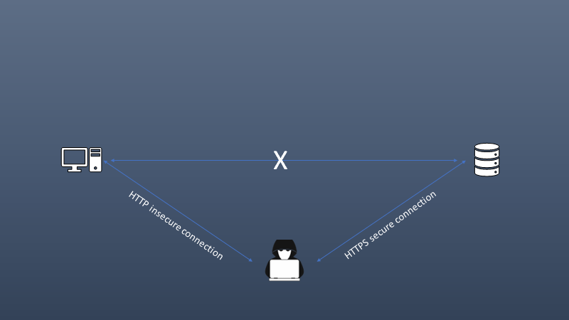

* An attack that combines an on-path attack with a downgrade attack in which the attacker sites in the middle of a conversation - must modify data between the victim and the web server acting as a proxy server or rogue Wi-Fi hotspot, using ARP spoofing, etc. The victim does not generally see any problem - except the browser page isn't encrypted. Removing the secure connection, traffic can be redirected, and instead of communicating to the web server the victim is communicating to the attacker.

#### Driver manipulation

_Security threats that involve altering system drivers to achieve a malicious outcome. Attackers can use shimming and refactoring to modify the behavior of an app, remove certain security features, bypass anti-virus or other security software, or hide the presence of malware._

##### Shimming

* Type of attack that targets a system's security measures.
* It is a form of malicious software designed to bypass security measures and gain access to the system.
* It works by inserting malicious code into a legitimate process or application.

##### Refactoring

* The process of restructuring existing code without changing its behavior. It is a way to improve the design, structure and implementation of software.
* Can also be used to help find bugs or vulnerabilities hidden in their software.

#### Pass the hash

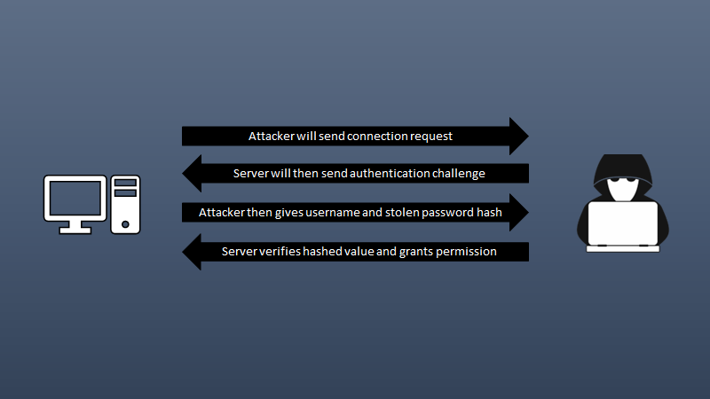

* Victim sends credentials to the server and during this attack intercepts (via ARP poisoning or some other form of redirection) the credentials on the network for the username and hashed password.
* They can now pretend to be the original user by sending those hashed credentials and pass those credentials to the server as if it were doing this from the original client.
* From the prospect of the server, this looks like normal authentication from a legitimate user and means that the attack would have access to that user's account on the server.

***

## Subdomain 1.4
###### [Back to Top](#top)

_Given a scenario, analyze potential indicators associated with network attacks_


#### Wireless

_Some wireless attack vectors include evil twins, rogue access points wireless attack vectors includePotential indicators of wireless network attacks can include unusual network activity, unauthorized access points, unusual wireless activity, unusual device behavior, unusual login activity, and more._

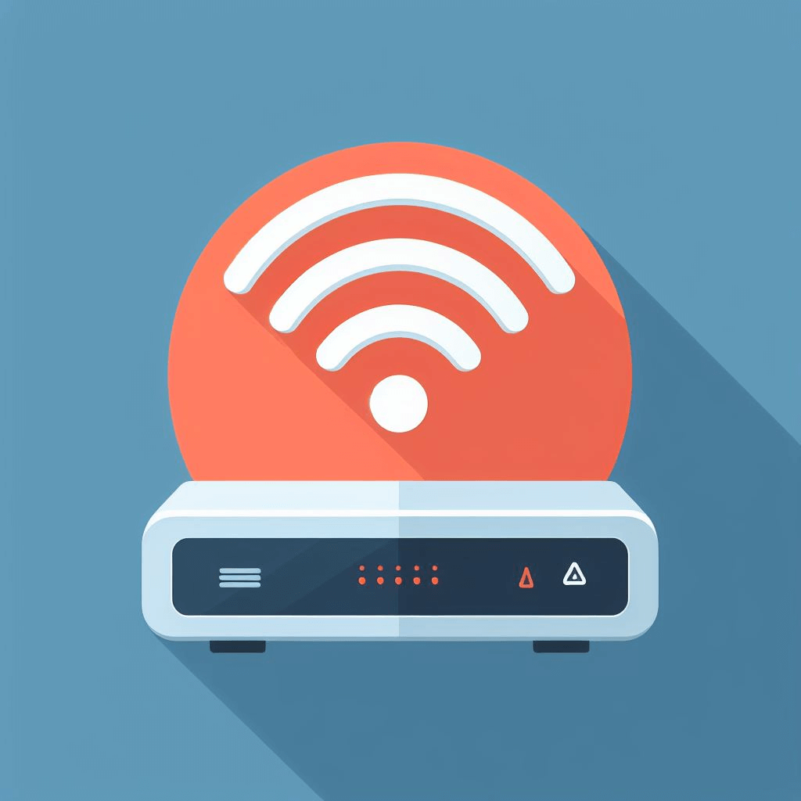

##### Evil twin

* A wireless access point with the same SSID as the legitimate access point.

##### Rogue access point

* An unauthorized access point that allows an attacker to bypass network security configurations.

##### Bluesnarfing

* The act of gaining unauthorized access to a device (and the network it is connected to) through its Bluetooth connection.

##### Bluejacking

* An attack that sends unsolicited messages over a Bluetooth connection.
* Example - with an address book object: Instead of contact name, write a message
* Third-party software may also be used.

##### Disassociation

* A type of Denial of Service (DoS) attack in which the attacker breaks the wireless connection between the victim device and the access point.
* The attack spoofs the MAC address of the victim's device and sends a deauthorization frame to an access point, causing the device to get disconnected from the network.

##### Jamming

* The intentional interference with communication signals to reduce signal strength or block them entirely.

##### Radio Frequency Identification (RFID)


* A technology that uses active or passive tags in the form of chips or smart labels that can store unique identifiers and relay this information to electronic readers.

##### Near-field communication

* A low-power communications protocol for short ranges between two devices.

##### Initialization vector (IV)

* A type of nonce, used for randomizing an encryption scheme.
* You may see this used in encryption ciphers, WEP, and some SSL implementation.
* Used in cryptography to ensure the same plaintext message encrypted with the same key doesn't produce the same ciphertext.
* Example of IV in an AES encryption:

  ```AES
  from Crypto.Cipher import AES
  from Crypto.Random import get_random_bytes

  key = get_random_bytes(16)
  cipher = AES.new(key, AES.MODE_CBC)
  iv = cipher.iv
  plaintext = b'This is a secret message'
  ciphertext = cipher.encrypt(plaintext)

  print(f'Key: {key.hex()}')
  print(f'IV: {iv.hex()}')
  print(f'Ciphertext: {ciphertext.hex()}')
  ```
  we use the `Crypto.Cipher` library to create an AES cipher object with a randomly generated 16-byte key. We then use the `MODE_CBC` mode to encrypt the plaintext message `b'This is a secret message'`. The initialization vector is generated automatically by the cipher object and can be accessed using `cipher.iv`. The ciphertext is then printed along with the key and IV.

#### On-path attack (previously known as man-in-the-middle attack/man-in-the-browser attack)

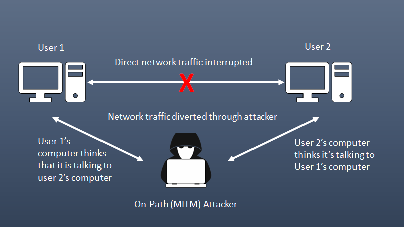

* An on-path attack is a type of attack where an attacker places themselves between two devices, intercepts and modifies communications between them.
* The attacker can collect information as well as impersonate either of the two agents.

#### Layer 2 attacks

_Attacks that target the data link layer of the OSI model. The data link layer is responsible for transferring data between adjacent network nodes in a wide area network (WAN) or local area network (LAN)._ 

##### Address resolution Protocol (ARP) poisoning

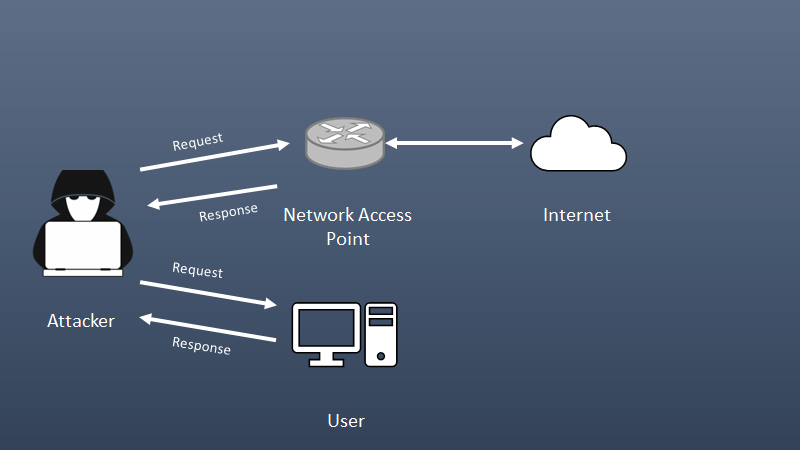

* An attack that exploits weaknesses in the ARP protocol to disrupt, redirect, or spy on network traffic.
* It is a technique where an attacker sends fake ARP messages to the target computer in order to associate the attacker's MAC address with the IP address of the target. This allows the attacker to intercept and modify network traffic between the host and other hosts on the network.

##### Media access control (MAC) flooding

* An attack that works by forcing legitimate MAC table contents out of the switch and forcing a unicast flooding behavior potentially sending sensitive information to portions of the network where it is not normally intended to go.
* Effectively turns the switch into a hub with all traffic transmitted to all interfaces.
* An attack can then easily capture all network traffic.

##### MAC cloning

* A type of attack where an attacker copies the MAC address of a legitimate device on the network to gain unauthorized access or redirect data. The attack can modify the MAC address of their device to match the MAC address of another device that is either on the network or has recently left the network.
* This can allow the attacker to bypass security devices or launch a man-in-the-middle attack.

#### Domain name system (DNS)

_Attacks that target the DNS. DNS is responsible for translating human-readable domain names into machine-readable IP addresses. Attackers can exploit vulnerabilities in the DNS to prevent users from accessing certain websites, or redirect them to malicious sites._

##### Domain hijacking

* The malicious action of changing the registration of a domain name without the authorization of the owner.
* May be accomplished by stealing the owner's logon credentials, using XSRF, session hijacking, or MitM; or by exploiting a flaw in the domain registrar's systems.

##### DNS poisoning

* A hacking technique that manipulates known vulnerabilities within the domain name system. The attack can reroute traffic from one site to a fake version, by entering fake information into the cache of a domain name server.

##### Uniform Resource Locator (URL) redirection

* Also known as URL forwarding, this technique is used to give more than one URL address to a page, a form, or a whole website/application. It is used to redirect a domain's visitors to a different URL.HTTP has a special kind of response, called a HTTP redirect, for this operation. Redirects use status codes defined within the HTTP protocol.
* Attackers will use this to redirect users to malicious sites without a victim's knowledge or consent. This is done by sending a link to the victim that appears to be legitimate but actually redirects them to a malicious website.

##### Domain reputation


* An attack that can damage your digital reputation by compromising a user's account and generating spam using it. If attackers gain access to more accounts or systems, your domain could become a spamming platform or part of a botnet, or used in part of a DoS attack, or for corporate espionage.

#### Distributed Denial-of-Service

_An attack where multiple systems, which are infected with malware, target a particular system to cause a Denial of Service attack. The attacker uses multiple servers and internet connections to flood the targeted resource with traffic, making it unavailable to legitimate users._

##### Network

* Attacks designed to flood the network with superfluous traffic. a DDoS attack results in either degraded network performance or an outright service outage of critical infrastructure.

##### Application

* A technique that makes an application break or work harder to increase downtime and costs.
* Example: Zip bombs, force overuse of a measured cloud resource (CPU/memory/network), increase the cloud server response time - spam deploying new application instances.

##### Operational technology (OT)

* A Denial of Service attack on hardware and software or industrial equipment such as electrical grids, traffic control, manufacturing plants, etc.

#### Malicious code or script execution

_The use of malware or scripts to exploit vulnerabilities in a system to gain unauthorized access to sensitive data._

##### PowerShell

* PowersShell - Cross-platform task automation solution made up of command-line shell, a scripting language, and a configuration management framework that runs on Windows, Linux, and MacOS.
* A way to extend command line functions and attack Windows systems including system administration, active domain administration, and file share access.

##### Python

* Python -  general-purpose scripting language that is popular in many technologies to attack infrastructure such as routers, servers, and switches.
* Example command to launch a DDoS attack using SimpleDDoS:

  ```python
  python dds.py <target_ip> <target_port> [-t <threads>] [-p <packets>]
  ```

Replace `<target_ip>` with the IP address of the target server, `<target_port>` with the port number, and `<threads>` and `<packets>` with the desired number of threads and packets, respectively.

Note: [GitHub](https://github.com/SSL-ACTX/SimpleDDoS) provides more information about SimpleDDoS.

##### Bash

* Bash - A Unix shell and command language that provides a command-line interface for interacting with the operating system and executing commands, scripts, and programs.
* Generating scripting within the Unix/Linux shell to attack environments including web, database, virtualization servers as well as the ability to control the OS from the command line.
* One way to check for DDoS attacks on a Linux server is by monitoring the server's load using the `uptime` command - it displays the average load over one minute, five minutes, and fifteen minutes. A load that equals or is bigger than the number of threads may suggest a suspiciously high activity.
* You can check the number of threads available on your server by using the following command: `grep processor /proc/cpuinfo | wc -1`.

##### Macros

* Macros - A way to automate functions within an application or OS.
* Can be exploited to create security vulnerabilities - they just need a user to open this file and accept the macro prompt.

##### Visual Basic for Applications (VBA)

* VBA - Normally a way to automate processes within Windows applications and common in Microsoft Office. It is a powerful programming language that interacts with the operating system. 
* It can be used to infect computers by running arbitrary code embedded in a document.

***

## Subdomain 1.5
###### [Back to Top](#top)

_Explain different threat actors, vectors, and intelligence sources._


#### Actors and threats

_An **actor** is an entity that performs actions on a system or network. Actors can be a human or non-human, such as a software program or a bot. Actors can perform a **threat**, which is defined as a possible danger that can exploit a vulnerability to breach the security of a system and cause harm._

##### Advanced Persistent Threat (APT)


* A covert cyber attack on a computer network where the attacker gains and maintains unauthorized access to the targeted network and remains unprotected for a significant period. It's intention is to exfiltrate or steal data rather than cause a network outage, denial of service, or infect systems with malware.
* Often goes hand in hand with social engineering tactics or exploit software vulnerabilities in organizations with high value information.

##### Insider threats


* A security threat that originates from within the organization being attacked or targeted, often an employee or officer of an organization or enterprise.
* This threat does not have to be a present employee or stakeholder, but can also be a former employee, board member, or anyone who at one time had access to proprietary or confidential information from within an organization or entity.

##### State actors


* A group or individual who is acting on behalf of a government or political entity.
* Unlike other threat actors, state actors have access to significant resources and are usually motivated by political or economic interests rather than financial gain.
* They are capable of launching sophisticated hacking operations that secretly infiltrate networks over prolonged periods and generally seek intelligence gathering, which can be used for espionage or military purposes.

##### Hacktivists

* 

##### Script kiddies

* 

##### Criminal Syndicates

* 

##### Hackers

* 

###### Authorized

* 

###### Unauthorized

* 

###### Semi-authorized

* 

##### Shadow IT

* 

##### Competitors

* 

#### Attributes of actors

__

##### Internal/external

* 

##### Level of sophistication/capability

* 

##### Resources/funding

* 

##### Intent/motivation

* 

#### Vectors


__

##### Direct access

* 

##### Wireless

* 

##### Email

* 

##### Supply chain

* 

##### Social media

* 

##### Removable media

* 

##### Cloud

* 

#### Threat intelligence sources

__

##### Open-source intelligence (OSINT)

* 

##### Closed/proprietary

* 

##### Vulnerability databases

* 

##### Public/private information-sharing centers

* 

##### Dark web

* 

##### Indicators of compromise

* 

##### Automated Indicator Sharing (AIS)

* 

###### Structured Threat Information eXpression (STIX)/Trusted Automated eXchange of Intelligence Information (TAXII)

* 

##### Predictive analysis

* 

##### Threat maps

* 

##### File/code repositories

* 

#### Research sources

* 

##### Vendor websites

* 

##### Vulnerability feeds

* 

##### Conferences

* 

##### Academic journals

* 

##### Request for comments (RFC)

* 

##### Local industry groups

* 

##### Social media

* 

##### Threat feeds

* 

##### Adversary tactics, techniques, and procedures (TTP)

* 

***

## Subdomain 1.6
###### [Back to Top](#top)

_Explain the security concerns associated with various types of vulnerabilities._

***

## Subdomain 1.7
###### [Back to Top](#top)

_Summarize the techniques used in security assessments._

***

## Subdomain 1.8
###### [Back to Top](#top)
_Explain the techniques used in penetration testing._

***

# Study Cards

* [Subdomain 1.1](../resources/study_cards/sub_one_one.html)
* [Subdomain 1.2](../resources/study_cards/sub_one_two.html)
* [Subdomain 1.3](../resources/study_cards/sub_one_three.html)
* [Subdomain 1.4](../resources/study_cards/sub_one_four.html)
* [Subdomain 1.5](../resources/study_cards/sub_one_five.html)
* [Subdomain 1.6](../resources/study_cards/sub_one_six.html)
* [Subdomain 1.7](../resources/study_cards/sub_one_seven.html)
* [Subdomain 1.8](../resources/study_cards/sub_one_eight.html)
