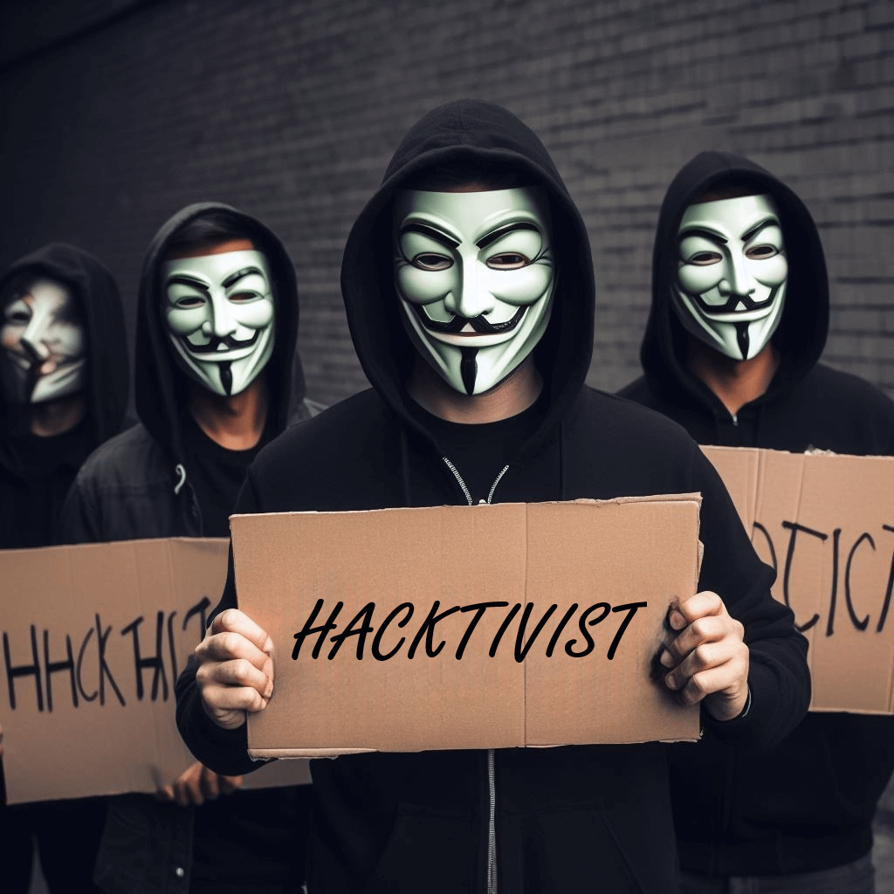
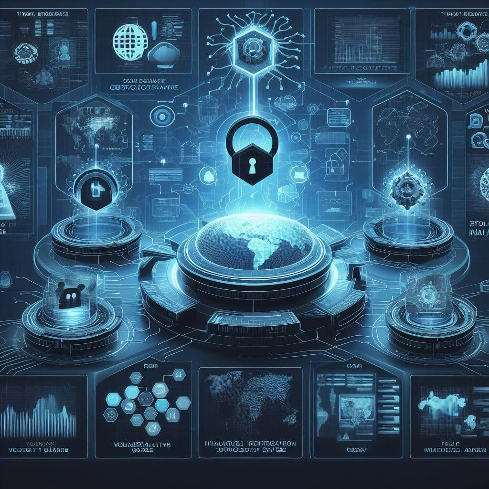
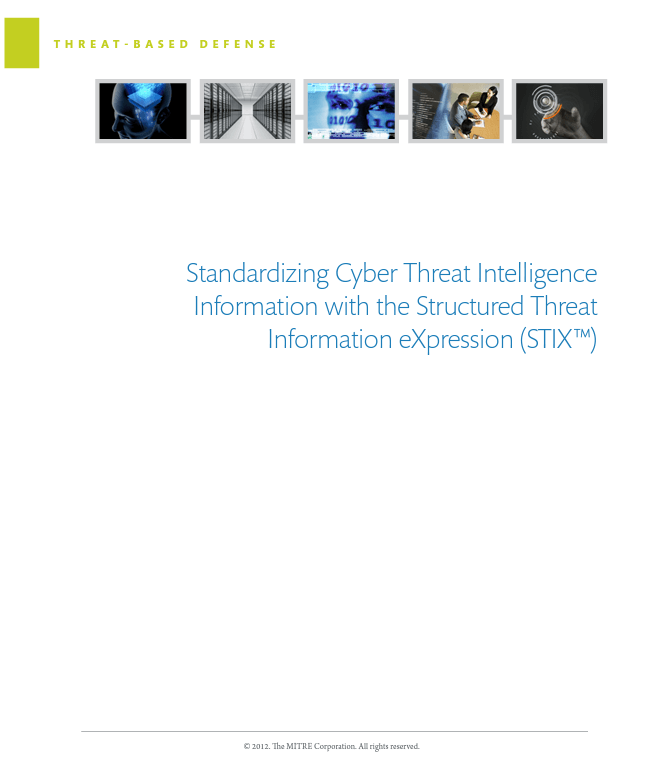
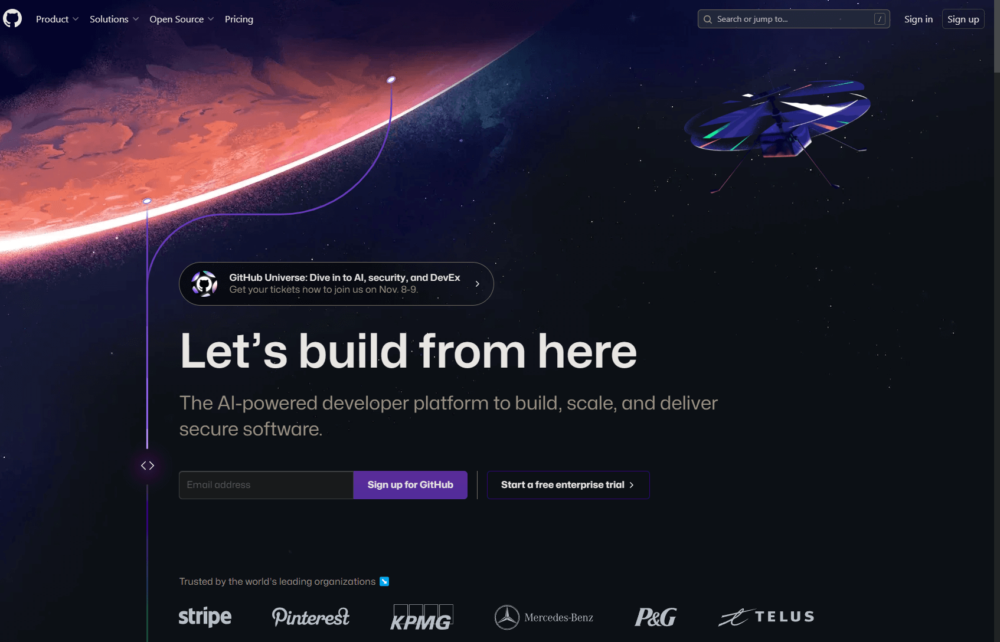
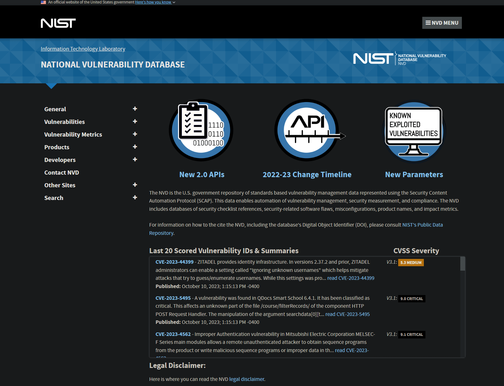
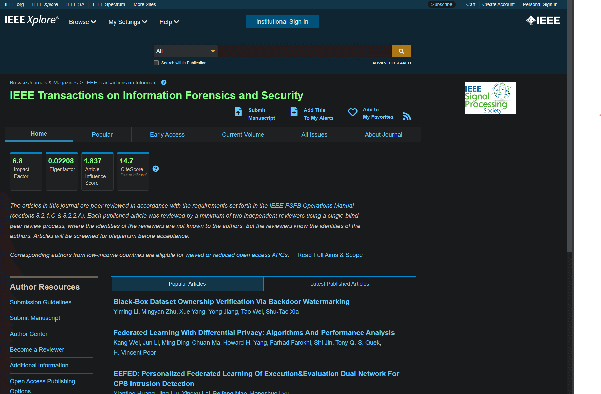
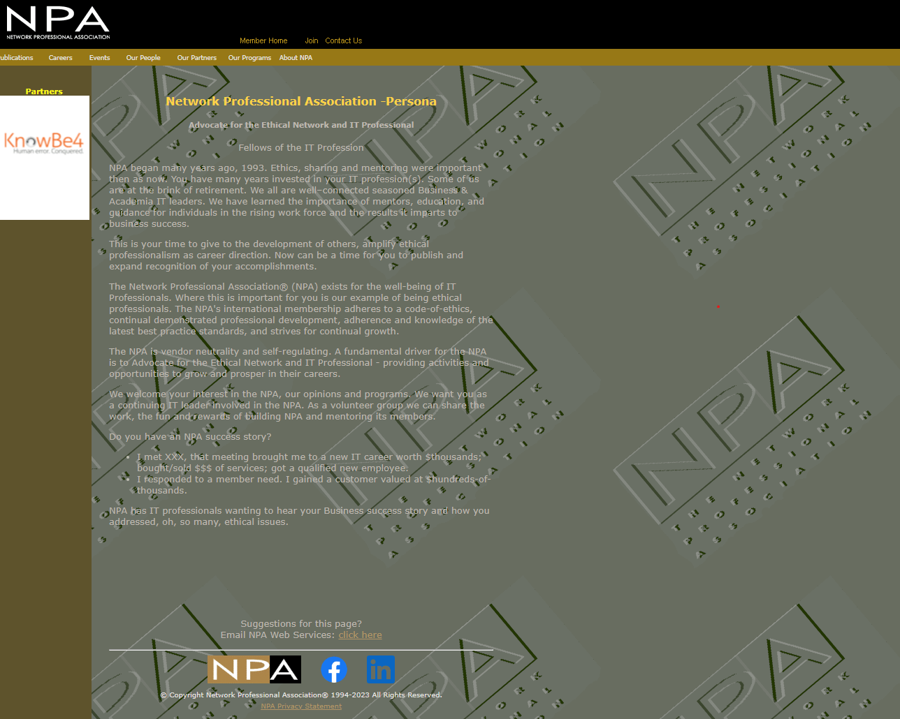

<a href="../../index.html">Back to Home</a> ♦ <a href="../domain_one.html">Back to Domain One</a>

# Subdomain 1.5

_Explain different threat actors, vectors, and intelligence sources._

_Terms_: 44

#### Actors and threats

_An **actor** is an entity that performs actions on a system or network. Actors can be a human or non-human, such as a software program or a bot. Actors can perform a **threat**, which is defined as a possible danger that can exploit a vulnerability to breach the security of a system and cause harm._

##### Advanced Persistent Threat (APT)

* A covert cyber attack on a computer network where the attacker gains and maintains unauthorized access to the targeted network and remains unprotected for a significant period. It's intention is to exfiltrate or steal data rather than cause a network outage, denial of service, or infect systems with malware.
* Often goes hand in hand with social engineering tactics or exploit software vulnerabilities in organizations with high value information.

##### Insider threats

* A security threat that originates from within the organization being attacked or targeted, often an employee or officer of an organization or enterprise.
* This threat does not have to be a present employee or stakeholder, but can also be a former employee, board member, or anyone who at one time had access to proprietary or confidential information from within an organization or entity.

##### State actors

* A group or individual who is acting on behalf of a government or political entity.
* Unlike other threat actors, state actors have access to significant resources and are usually motivated by political or economic interests rather than financial gain.
* They are capable of launching sophisticated hacking operations that secretly infiltrate networks over prolonged periods and generally seek intelligence gathering, which can be used for espionage or military purposes.

##### Hacktivists

* Hackers who are driven by a cause like social change, political agendas, or terrorism.
* Examples of these organizations include [Anonymous](https://www.politico.com/news/2023/10/15/hackers-israel-hamas-war-00121593), [LulzSec](https://hackaday.com/2016/01/26/the-dark-arts-meet-the-lulzsec-hackers/), [RedHack](https://en.wikipedia.org/wiki/RedHack), and [Chaos Computer Club](https://hackaday.com/2014/12/06/chaos-computer-club-and-hackaday-blocked-by-british-porn-filters/).

##### Script kiddies

* Hackers with little to no skill who only use the tools and exploits written by others.

##### Criminal Syndicates

* Professional criminals, motivated by money and very sophisticated.
* Organized - One person attacks, one person manages the exploits, another person sells the data, another handles customer support.
* They have lots of capital to fund hacking efforts.

#### Hackers

_An individual who exploits vulnerabilities in computer systems, networks, or firewalls to gain unauthorized access. It is important to note that there are different types of hacking._

###### Authorized

* An **ethical** hacker with good intents and **permission** to attack

###### Unauthorized

* A hacker who is **malicious** in nature and **violates security** for personal gain.

###### Semi-authorized

* A hacker that may find a vulnerability but **doesn't use it**.

##### Shadow IT

* Use of IT systems, devices, software, applications, or services without the explicit approval of the IT department.
* Examples include meeting on Skype when the company uses WebEx, starting a group Slack without IT approval, or sharing work files on a personal Dropbox account or thumb drive.

##### Competitors

* A company with a similar product(s) and target similar customers that use a high level of sophistication to potentially harm the reputation, commit espionage on or DoS on one of of it's rivals.

#### Attributes of actors

_Some attributes that distinguish the different types of threat actors include their level of sophistication, resources, motivation, funding, among others._

##### Internal/external

* Internal - Trusted insiders that have permissions to be on the organizations network and information systems. These users have authorized access to information and systems.
* External - Actors that come from outside the organization and do not have authorized access to the organizations informations systems, data, or physical resources and spaces.

##### Level of sophistication/capability

* An important factor in the determination of the risk of threat actors.
* Highly sophisticated threat actors are more likely to be successful if an attack is launched. Can include nation-state actors, organized crime, etc.
* Less sophisticated attackers have a lower probability of an attack being successful should it be launched. Can include script kiddies, etc.

##### Resources/funding

* These attributes determine how well a threat actor is able to support the attack monetarily or with the needed equipment and software.

##### Intent/motivation

* An important factor in a successful attack against an organization.
* Highly motivated threat actors are more likely to actually launch an attack against an organization while less motivated actors may prepare but never launch the attack.
* The intent or motivation of an actor may be tied to the political, ideological or personal goals of the attacker.

#### Vectors

_Refer to the methods that attackers use to gain unauthorized access to a computer system or network. Can be classified into various categories such as direct access, wireless, email, supply chain, and many others._

##### Direct access

* Attack vectors that are available to an attacker who has direct access to the hardware that is running an operating system.
* If an attacker has physical access to the system, they can find a way into the operating system and have a lot of attack vectors available to them.
* Examples: attaching a keylogger to a keyboard, connecting a flash drive or other type of portal media to copy files from a server that can be taken outside of the building.

##### Wireless

* Refer to attack vectors that are available to an attacker on wireless networks.
* Examples would include gathering default login credentials to modify AP configuration, setting up a rogue access point or evil twin.

##### Email

* Refer to attack vectors that are available to an attacker through email.
* This is traditionally a successful attack vector for threat actors because so many people have an email account.
* A common threat actor in an email might be an embedded link or an attached file. Link/file is malicious and will allow the actor to access the computer.

##### Supply chain

* Attack vectors that are available to an attacker via supply chain vulnerabilities.
* Examples would be gaining access to a network using a vendor, using malware to modify the manufacturing process, counterfeit network equipment to install backdoors or provide substandard performance, etc.

##### Social media

* Attack vectors that are available to an attacker through means of social media.
* Attackers can use your profile data to tell where you are or have been, your age/DOB, create a fake friend account and a request to the victim to gather even more details.

##### Removable media

* Attack vectors that are available to an attacker through removable media.
* They can contain malicious software and can exfiltrate data.

##### Cloud

* Attack vectors that are available in the cloud. With publicly facing applications and services, mistakes are made all the time.
* Some attack examples can include exploiting security misconfigurations, brute force attacking accounts or phish the users of the cloud service, perform orchestration attacks, or perform DoS attacks to disable cloud services for everyone.

#### Threat intelligence sources

_Are a crucial component of cybersecurity. They provide information about potential threats and vulnerabilities that can be used to prevent attacks._

##### Open-source intelligence (OSINT)

* Methods of obtaining information about a person or organization through public records, websites, and social media.

##### Closed/proprietary

* Threat data that are collected and analyzed by private companies or organizations, such as security vendors, industry groups, or research institutes.
* They may offer their threat intelligence as a service or a platform to their customers or partners, who can use it to enhance their own security posture and response.
* Some free to premium examples include [PhishTank](https://phishtank.org/), [DocGuard](https://www.docguard.io/), and [AlienVault Open Threat Exchange](https://otx.alienvault.com/).

##### Vulnerability databases

* A platform that collects and provides information about security flaws in software. It can help identify, access, and mitigate vulnerabilities in systems.
* Some examples of these databases are the [US National Vulnerability Database](https://nvd.nist.gov/) and [Common Vulnerabilities and Exposures](https://www.cve.org/).

##### Public/private information-sharing centers

* Non-profit organizations that provide a central resource for gathering and sharing information on cyber threats between the private and public sector.
* For example, [Cyber Threat Alliance (CTA)](https://www.cyberthreatalliance.org/) is where members upload specifically formatted threat intelligence. CTA scores each submission and validates across other submissions. Other members can extract the validated data.

##### Dark web

* Content not indexed by search engines.
* Are overlay networks that use the internet. Usually requires specific software, specific configuration, or authorization to access.
* Provide hacking groups and services.
* Can include forums to see targeted company or executive names.

##### Indicators of compromise

* Clues that suggest a system or network has been breached or infected by malware.
* They can be file-based, network-based, or behavioral.
* Some examples are unusual outbound network traffic, anomalies in privileged user account activity, mismatched port-application traffic, or swells in database read volume.

##### Automated Indicator Sharing (AIS)

* A service that enables real-time exchange of machine-readable cyber threat indicators and defensive measures between public and private-sector organizations.
* It is a way of staying proactive with respect to cybersecurity.

###### Structured Threat Information eXpression (STIX)

* Describes cyber threat information.
* Includes motivations, abilities, capabilities, and response information.
* Document describing STIX - [MITRE](https://www.mitre.org/sites/default/files/publications/stix.pdf).

###### Trusted Automated eXchange of Intelligence Information (TAXII)

* Securely shares STIX data.
* Use cases include public alerts or warnings, private alerts and reports, push and pull content dissemination, and set-up and management of data sharing between parties.

##### Predictive analysis

* Analyzes large amounts of data to identify behaviors (DNS queries, traffic patterns, location data, etc.) and creates a forecast for potential attacks - an early warning system.
* Often combined with machine learning - less emphasis on signatures.

##### Threat maps

* A visualization of real-life cyberattacks happening in real-time and show the level of severity, location and nature of the attack. They can be valuable to help a security team make connections and predictions on future attacks.

##### File/code repositories

* Online platforms that allow developers to store, manage, and share their code. Can see what hackers are building, see what people may be accidently releasing.
* Examples may include [GitHub](github.com), [GitLab](https://about.gitlab.com/), [Bitbucket](https://bitbucket.org/product), and [SourceForge](https://sourceforge.net/).

#### Research sources

_Researching and understanding potential threats is an ongoing part of any security professional's job. There are several sources that can be used to gather information about potential threats including vendor websites, vulnerability feeds, academic journals and RFCs._

##### Vendor websites

* Are a type of research source that can be used to gather information about potential threats.
* These websites are usually maintained by the companies that produce software or hardware that is being used.
* They are a great resource for learning about vulnerabilities and other security issues that may be present in their products and they often have a page dedicated to tracking them down. They also offer some type of notification process to inform users when new vulnerabilities are discovered.

##### Vulnerability feeds

* A source of information about security vulnerabilities that affect software, hardware, or networks.
* They can help you stay updated on the latest threats and patches, and plan your security strategy accordingly.
* Some examples are the [National Vulnerability Database](https://nvd.nist.gov/), [CVE data feeds](https://nvd.nist.gov/vuln/data-feeds).

##### Conferences

* Events where experts and researchers present their latest findings on insights of various topics related to security.
* Can include new DDoS methods, intelligence gathering, and hacking the latest technologies.
* Can build relationships and forge alliances with other members of the security community.

##### Academic journals

* Research from academic professionals using cutting edge security analysis, evaluations of existing security technologies - keeping up with the latest attack methods, detailed postmortem; tear apart the latest malware and see what makes them tick, extremely detailed information.
* Example: [IEEE Transactions on Information Forensics and Security](https://ieeexplore.ieee.org/xpl/RecentIssue.jsp?punumber=10206)

##### Request for comments (RFC)

* A formal standards-track document developed in working groups within the [Internet Engineering Task Force (IETF)](https://www.ietf.org/standards/rfcs/). The process is for all PCI Security Standards - both new standards under development and existing standards subject to revision. 
* They are opportunities for PCI SSC stakeholders to provide feedback on existing and new PCI Security Standards.
* [RFC Index](https://www.rfc-editor.org/rfc-index-100a.html)

##### Local industry groups

* A gathering of local peers with shared industry and technology along with geographical presence.
* May include associations like the [Information Systems Security Association](https://www.issa.org/), [Network Professional Association](https://www.npa.org/npa-home.cfm) where you can meet others in the area and discuss local challenges.
* Can also include industry user groups such as Cisco, Microsoft, VMWare, etc.

##### Social media

* Using social media channels to monitor hacking group conversations, use keyword monitoring, analysis of vulnerabilities such as professionals discussing details.
* Can also be used for command and control - use social media as the transport.

##### Threat feeds

* Collection of data from a variety of sources that can help bolster your SIEM security.
* They are continuous data streams filled with threat information collected by AI.
* Any cybersecurity risk data that organizations can use to better understand their overall threat landscape is considered threat intelligence. Most feeds focus on one area of interest, such as domains, malicious IP addresses, or botnet activity.
* Many are [freely available](https://otx.alienvault.com/browse/global/pulses?include_inactive=0&sort=-modified&page=1&limit=10); others require [paid subscriptions](https://www.mandiant.com/advantage/threat-intelligence).

##### Adversary tactics, techniques, and procedures (TTP)

* Describe real-world adversary behavior and tactics.
* Tactics best describe the adversary objectives and provide a high-level notation of an operation.
* Techniques describe the non-specific guidelines and intermediate methods that describe how a tactic action can be realized.
* Procedures refer to the sequence of actions performed using a technique to execute on an attack tactic
* Different types:
  * Information on targeted systems (finance, energy companies)
  * Infrastructure used by attackers (DNS and IP addresses)
  * Outbreak of a particular malware variant on a service type

***

# Demonstrate Your Understanding

<a href="#top">Back to Top</a> ♦ <a href="../../resources/study_cards/sub_one_five.html" target="_blank">Study in a New Tab</a>

_Click or tap on 'Choose a Study Mode' to switch between flash cards, match, learn, test and more._

<iframe src="https://quizlet.com/815852736/flashcards/embed?i=35mna1&x=1jj1" height="500" width="100%" style="border:0"></iframe>