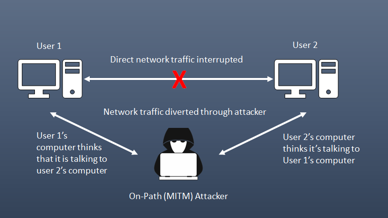

[Back to Home](../../index.html) \| [Back to Domain One](../domain_one.html)

# Subdomain 1.4

_Given a scenario, analyze potential indicators associated with network attacks_

_Terms_: 25


#### Wireless

_Some wireless attack vectors include evil twins, rogue access points wireless attack vectors includePotential indicators of wireless network attacks can include unusual network activity, unauthorized access points, unusual wireless activity, unusual device behavior, unusual login activity, and more._


##### Evil twin

* A wireless access point with the same SSID as the legitimate access point.

##### Rogue access point

* An unauthorized access point that allows an attacker to bypass network security configurations.

##### Bluesnarfing

* The act of gaining unauthorized access to a device (and the network it is connected to) through its Bluetooth connection.

##### Bluejacking

* An attack that sends unsolicited messages over a Bluetooth connection.
* Example - with an address book object: Instead of contact name, write a message
* Third-party software may also be used.

##### Disassociation

* A type of Denial of Service (DoS) attack in which the attacker breaks the wireless connection between the victim device and the access point.
* The attack spoofs the MAC address of the victim's device and sends a deauthorization frame to an access point, causing the device to get disconnected from the network.

##### Jamming

* The intentional interference with communication signals to reduce signal strength or block them entirely.

##### Radio Frequency Identification (RFID)


* A technology that uses active or passive tags in the form of chips or smart labels that can store unique identifiers and relay this information to electronic readers.

##### Near-field communication

* A low-power communications protocol for short ranges between two devices.

##### Initialization vector (IV)

* A type of nonce, used for randomizing an encryption scheme.
* You may see this used in encryption ciphers, WEP, and some SSL implementation.
* Used in cryptography to ensure the same plaintext message encrypted with the same key doesn't produce the same ciphertext.
* Example of IV in an AES encryption:

  ```AES
  from Crypto.Cipher import AES
  from Crypto.Random import get_random_bytes

  key = get_random_bytes(16)
  cipher = AES.new(key, AES.MODE_CBC)
  iv = cipher.iv
  plaintext = b'This is a secret message'
  ciphertext = cipher.encrypt(plaintext)

  print(f'Key: {key.hex()}')
  print(f'IV: {iv.hex()}')
  print(f'Ciphertext: {ciphertext.hex()}')
  ```
  we use the `Crypto.Cipher` library to create an AES cipher object with a randomly generated 16-byte key. We then use the `MODE_CBC` mode to encrypt the plaintext message `b'This is a secret message'`. The initialization vector is generated automatically by the cipher object and can be accessed using `cipher.iv`. The ciphertext is then printed along with the key and IV.

#### On-path attack (previously known as man-in-the-middle attack/man-in-the-browser attack)



* An on-path attack is a type of attack where an attacker places themselves between two devices, intercepts and modifies communications between them.
* The attacker can collect information as well as impersonate either of the two agents.

#### Layer 2 attacks

_Attacks that target the data link layer of the OSI model. The data link layer is responsible for transferring data between adjacent network nodes in a wide area network (WAN) or local area network (LAN)._ 

##### Address resolution Protocol (ARP) poisoning


* An attack that exploits weaknesses in the ARP protocol to disrupt, redirect, or spy on network traffic.
* It is a technique where an attacker sends fake ARP messages to the target computer in order to associate the attacker's MAC address with the IP address of the target. This allows the attacker to intercept and modify network traffic between the host and other hosts on the network.

##### Media access control (MAC) flooding

* An attack that works by forcing legitimate MAC table contents out of the switch and forcing a unicast flooding behavior potentially sending sensitive information to portions of the network where it is not normally intended to go.
* Effectively turns the switch into a hub with all traffic transmitted to all interfaces.
* An attack can then easily capture all network traffic.

##### MAC cloning

* A type of attack where an attacker copies the MAC address of a legitimate device on the network to gain unauthorized access or redirect data. The attack can modify the MAC address of their device to match the MAC address of another device that is either on the network or has recently left the network.
* This can allow the attacker to bypass security devices or launch a man-in-the-middle attack.

#### Domain name system (DNS)

_Attacks that target the DNS. DNS is responsible for translating human-readable domain names into machine-readable IP addresses. Attackers can exploit vulnerabilities in the DNS to prevent users from accessing certain websites, or redirect them to malicious sites._

##### Domain hijacking

* The malicious action of changing the registration of a domain name without the authorization of the owner.
* May be accomplished by stealing the owner's logon credentials, using XSRF, session hijacking, or MitM; or by exploiting a flaw in the domain registrar's systems.

##### DNS poisoning

* A hacking technique that manipulates known vulnerabilities within the domain name system. The attack can reroute traffic from one site to a fake version, by entering fake information into the cache of a domain name server.

##### Uniform Resource Locator (URL) redirection

* Also known as URL forwarding, this technique is used to give more than one URL address to a page, a form, or a whole website/application. It is used to redirect a domain's visitors to a different URL.HTTP has a special kind of response, called a HTTP redirect, for this operation. Redirects use status codes defined within the HTTP protocol.
* Attackers will use this to redirect users to malicious sites without a victim's knowledge or consent. This is done by sending a link to the victim that appears to be legitimate but actually redirects them to a malicious website.

##### Domain reputation


* An attack that can damage your digital reputation by compromising a user's account and generating spam using it. If attackers gain access to more accounts or systems, your domain could become a spamming platform or part of a botnet, or used in part of a DoS attack, or for corporate espionage.

#### Distributed Denial-of-Service

_An attack where multiple systems, which are infected with malware, target a particular system to cause a Denial of Service attack. The attacker uses multiple servers and internet connections to flood the targeted resource with traffic, making it unavailable to legitimate users._

##### Network

* Attacks designed to flood the network with superfluous traffic. a DDoS attack results in either degraded network performance or an outright service outage of critical infrastructure.

##### Application

* A technique that makes an application break or work harder to increase downtime and costs.
* Example: Zip bombs, force overuse of a measured cloud resource (CPU/memory/network), increase the cloud server response time - spam deploying new application instances.

##### Operational technology (OT)

* A Denial of Service attack on hardware and software or industrial equipment such as electrical grids, traffic control, manufacturing plants, etc.

#### Malicious code or script execution

_The use of malware or scripts to exploit vulnerabilities in a system to gain unauthorized access to sensitive data._

##### PowerShell

* PowersShell - Cross-platform task automation solution made up of command-line shell, a scripting language, and a configuration management framework that runs on Windows, Linux, and MacOS.
* A way to extend command line functions and attack Windows systems including system administration, active domain administration, and file share access.

##### Python

* Python -  general-purpose scripting language that is popular in many technologies to attack infrastructure such as routers, servers, and switches.
* Example command to launch a DDoS attack using SimpleDDoS:

  ```python
  python dds.py <target_ip> <target_port> [-t <threads>] [-p <packets>]
  ```

Replace `<target_ip>` with the IP address of the target server, `<target_port>` with the port number, and `<threads>` and `<packets>` with the desired number of threads and packets, respectively.

Note: [GitHub](https://github.com/SSL-ACTX/SimpleDDoS) provides more information about SimpleDDoS.

##### Bash

* Bash - A Unix shell and command language that provides a command-line interface for interacting with the operating system and executing commands, scripts, and programs.
* Generating scripting within the Unix/Linux shell to attack environments including web, database, virtualization servers as well as the ability to control the OS from the command line.
* One way to check for DDoS attacks on a Linux server is by monitoring the server's load using the `uptime` command - it displays the average load over one minute, five minutes, and fifteen minutes. A load that equals or is bigger than the number of threads may suggest a suspiciously high activity.
* You can check the number of threads available on your server by using the following command: `grep processor /proc/cpuinfo | wc -1`.

##### Macros

* Macros - A way to automate functions within an application or OS.
* Can be exploited to create security vulnerabilities - they just need a user to open this file and accept the macro prompt.

##### Visual Basic for Applications (VBA)

* VBA - Normally a way to automate processes within Windows applications and common in Microsoft Office. It is a powerful programming language that interacts with the operating system. 
* It can be used to infect computers by running arbitrary code embedded in a document.

***

# Demonstrate Your Understanding

[Back to Top](#top) \| [Study in a New Tab](../../resources/study_cards/sub_one_four.html){:target="_blank"}

_Click or tap on 'Choose a Study Mode' to switch between flash cards, match, learn, test and more._

<iframe src="https://quizlet.com/815665812/flashcards/embed?i=35mna1&x=1jj1" height="500" width="100%" style="border:0"></iframe>