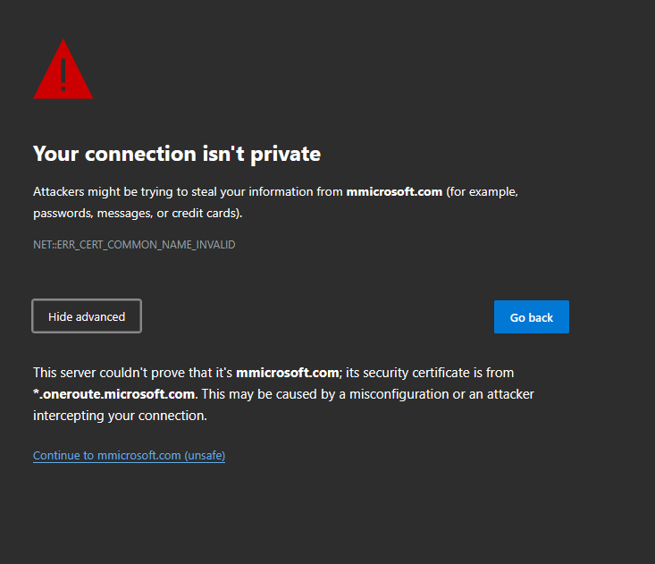
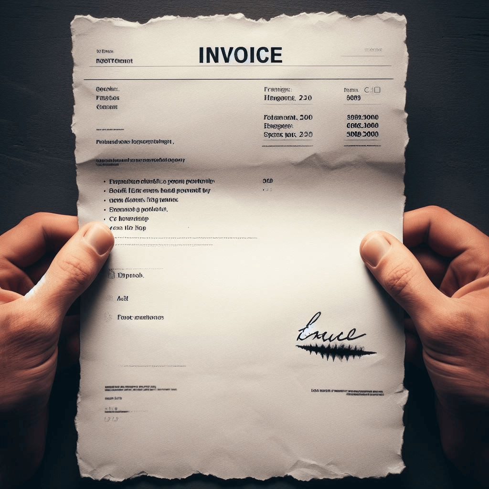
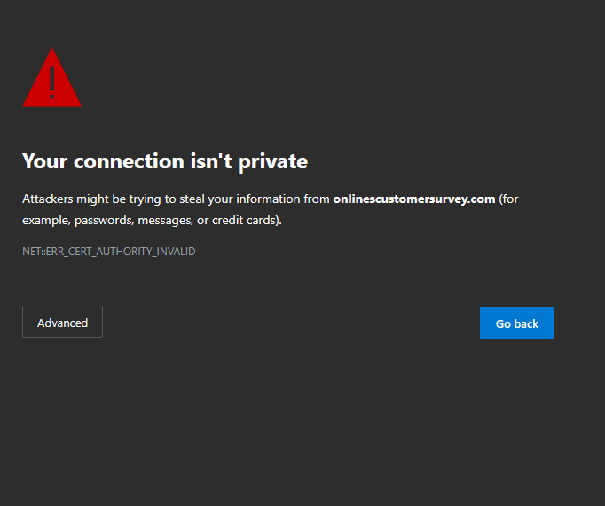

[Back to Home](../../index.html) ☷ [Back to Domain One](../domain_one.html)

# Subdomain 1.1

**Compare and contrast different types of social engineering techniques.**

**The act of gathering info on an attack by taking advantage of the weakest part of security: _people_.**

_Terms_: 32

***

#### Phishing

* A form of social engineering where attackers deceive people into revealing sensitive information or installing malware such as ransomware.
* Often delivered through email, text, etc.
* Often noticeable issues with spelling, fonts, graphics.

#### Smishing

* Phishing via SMS, mass text messages sent to users asking for sensitive information or encouraging them to visit a fake website.
* Spoofing is generally an issue.
* Will receive SMS with unsuspecting link or asks for personal information from the victim.

#### Vishing

* A special type of phishing that uses Voice over IP (VoIP).
* Caller ID spoofing is common in this scenario.
* Calls received can include fake security checks or ask the victim to update personal information for a business or service.

#### Spam

* A form of unsolicited messages in the form of email, forums, etc. with various content including commercial advertising, non-commercial proselytizing, and phishing attempts.

#### Spam over instant messaging (SPIM)

* Spam that is delivered through instant messaging.

#### Spear phishing

* A phishing expedition in which the emails are carefully designed to target specific groups or organizations.

#### Dumpster diving

* Searching the garbage collection area or dustbin to look for non-shredded confidential documents
* Timing can be important - End of month, end of quarter. Based on pickup schedule.
* Protect trash - locks on dumpsters, shred confidential documents. Governments burn documents.

#### Shoulder surfing

* This is a social engineering attack in which the attackers obtain confidential information by looking over someone's shoulder to read what is on their computer screen or phone or to observe what they are typing.
* Can be in public areas such as airports and coffee shops.
* Can be done from afar using binoculars or through monitoring webcams.
* Prevent by using privacy filters, keep monitor out of sight, and be aware of your surroundings.

#### Pharming

* Traffic redirection to a Web site that looks identical to the intended website in order to capture the victim's PII/login credentials.
* Difficult for anti-malware to stop as everything seems legit for the unsuspecting users.
* Can use poisoned DNS server or client vulnerabilities.

#### Tailgating

* Gaining unauthorized access to restricted areas by following another person.
* Most security stops at the border so once inside, there is generally not much to stop the perpetrator.

#### Eliciting information

* The act of extracting information from the victim.
* "Hacking the human,"
* Well-documented psychological techniques.

#### Whaling

* A type of phishing targeted at high-level personnel such as senior executives.
* CFO or other executives targeted through phishing or other methods.
* Executives generally have direct access to corporate banking.

#### Prepending

* An attacker adds a term or phrase to the header of an email to enhance its effectiveness as a social engineering attack.
* Example: `https://mmicrosoft.com`

#### Identity fraud

* The use of one person of another person's personal information, without authorization, to commit a crime or to deceive or defraud that other person or a third person.
* Credit fraud - open an account under your name or take your credit card information.
* Bank fraud - opens an account under your name or gains access to your bank account.
* Loan fraud - Your personal information is used for a loan/lease.
* Government benefits fraud - Attacker claims benefits using your identity.
* Always verify before giving away information to another individual or organization. Don't give out passwords or disclose personal details.

#### Invoice scams

* When an attacker sends a fake invoice to a business for something such as a domain renewal, toner cartridges, etc., and states the invoice is from the CEO. The business may pay the invoice since it looks like it is coming from a legitimate source.
* Invoice looks like a legitimate one requesting printing services, lawn work, etc.
* Might also include a link to make the payment which the attacker can use to gain payment details.

#### Credential harvesting

* The process of collecting login credentials. May deploy malware on unsuspecting users to achieve goals.
* Macros may download credential-harvesting software through emails containing attachments.
* Victim generally clueless as harvesting happens in the background.

#### Reconnaissance

* Gathering information on a victim. Gathers background information to build a believable pretext.

#### Hoax

* A threat that does not actually exist, is often in the form of an email, and still often consumes excessive resources.
* Hoax is often spread through email or social media.
* Some will take your money or waste as much time investigating it as if it were a legitimate issue.
* Spam filters can help
* Cross reference with others de-hoax sources such as hoax-slayer.net.

#### Impersonation

* An attacker who pretends to be someone else in the hopes of eliciting Personally Identifiable Information (PII).
* May use details gathered from reconnaissance - they know your place of work, bank, etc.
* Attacker may try and be chummy to lower the victim's guard.
* Attacker may also try to act like a superior and pull rank.

#### Watering hole attack

* A malicious attack that is directed toward a small group of specific individuals who visit the same website.
* Site determination may be educated guess such as local eateries or industry related websites.
* Watch the watering hole by using defense-in-depth, deploy firewalls and IPS, ensure anti-malware signature updates are continuously deployed.

#### Typosquating

* A type of URL hijacking where there is a site with URLs that are slightly different from a legitimate source.
* Example: `https://microsoftt.com`

#### Pretexting

* A social engineering tactic that involves creating a false pretext or scenario to trick someone into divulging sensitive information.
* Attacker would claim information is needed to rectify some issue - if a user or employee falls for the false pretext, they would unwittingly hand over their login credentials or personal information to the attacker who could then use them to gain unauthorized access to the company's network or sensitive data, or personal information to access a banking site or other service.
* Actor is a character in a scenario they create - "Hello, this is account services with XYZ. We want to confirm your banking information..."

#### Influence Campaigns
_Usually nation-state actors that divide, distract, persuade and sway public opinion on political and social issues._

##### Hybrid Warfare

* Originally a military strategy - a broad description of techniques to wage war non-traditionally.
* With the dawn of the internet and cyberwarfare, it includes instilling fake news to complete goals such as influencing foreign elections.

##### Social Media

* When a threat actor creates fake accounts, creates content on those fake accounts to seem legitimate, post on social media using these fake accounts, amplify message, real users share the message, and then mass media picks up the story.

## Principles -reasons for effectiveness
_Principles of Social Engineering and their reasons for effectiveness._

##### Authority

* To impersonate or imply a position of authority.
* Attacker will impersonate someone such as a police officer or Help Desk employee to try and spoof you into giving away information.

##### Intimidation

* To frighten by threat.
* "If you don't get me the credentials for that server, the whole thing will go down..."

##### Consensus

* Influence a victim by what others do; everyone else does it!
* "Well Bill who works with you did this for me before..."

##### Scarcity

* To describe a lack of something.
* Limited resources or time to act.
* "We need to act before we run out..."

##### Familiarity

* To imply a closer relationship or someone who is well known.
* "Common friends" or someone you know. "Hey it's me, Bill's third cousin Franklin..."

##### Trust

* To assure reliance on their honesty and integrity.
* Gain their confidence, become their friend.
* "I'm from the Help Desk and I'm here to assist..."

##### Urgency

* To call for immediate action.
* Rush the victim, cause them not to think.

***

# Demonstrate Your Understanding
###### [Back to Top](#top)
_Click or tap on 'Choose a Study Mode' to switch between flash cards, match, learn, test and more._

<iframe src="https://quizlet.com/814299020/flashcards/embed?i=35mna1&x=1jj1" height="500" width="100%" style="border:0"></iframe>