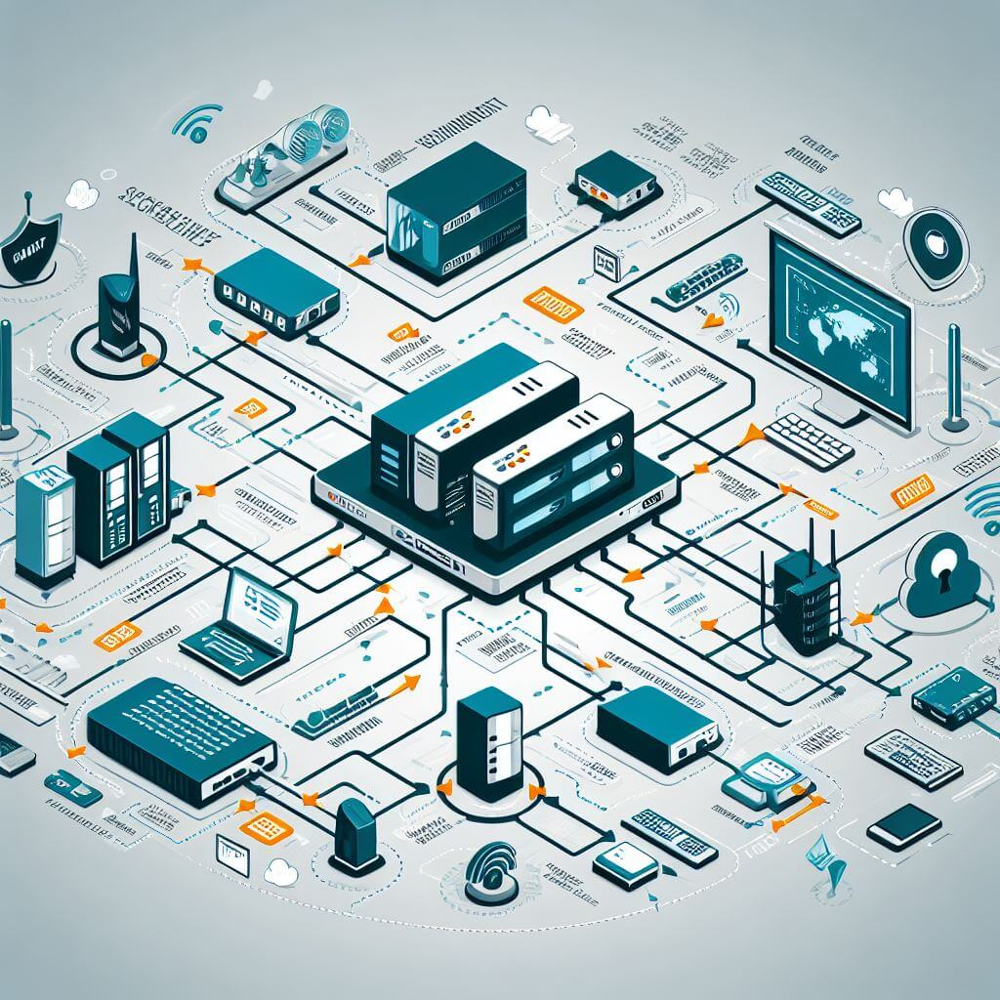

<a href="../../index.html">Back to Home</a> ♦ <a href="../domain_one.html">Back to Domain One</a>

# Subdomain 1.6

_Explain the security concerns associated with various types of vulnerabilities._

_Terms_: 24

#### Cloud-based vs. on-premises vulnerabilities

* Cloud-based vulnerabilities include misconfigured cloud storage, insecure APIs, compliance violations and regulatory actions, poor access management, and lack of authentication methods, etc. Hardware related vulnerabilities are handled by the cloud provider.
* On-premises is operated by the business unlike cloud-operated hardware so on-premises vulnerabilities include physical theft or damage to equipment, also phishing and malware among others.

#### Zero-day

* A vulnerability that has not been detected or published - flaws or holes in software.
* Term "zero-day" refers to the face that the software developers has zero days to fix the issue because it becomes known and potentially exploitable as soon as it's discovered. Makes them particularly dangerous because there is no time to release a patch or update before potential attackers can take advantage of it. 
* Can lead to unauthorized access, data theft, or other forms of cyberattacks.
* Can exist in operating systems, applications, or other types of software.

#### Weak configurations

_Concerns referring to issues that arise from improperly configured systems, applications, or networks, which can lead to security vulnerabilities. Can potentially be exploited by malicious actors to gain unauthorized access, steal data, disrupt services, or carry out other malicious activities._

##### Open permissions

* Vulnerability type where information has been put onto the internet, but no security has been applied to that data.
* Attackers don't need to find a hidden vulnerability that is inside of software, instead they wait for you to leave the door open, and they simply walk into that open door.

##### Unsecure root accounts

* Refer to the root account in Linux and the admin account in Windows that have weak passwords or no passwords at all.
* These accounts can be used by attackers to gain access to sensitive data and systems.

##### Errors

* Messages of this type of weak configuration can provide useful information to an attacker: service type, version information, debug data, etc.

##### Weak encryption

* A vulnerability that occurs when encryption is relatively easy or simple to decrypt without the encryption key.
* It is important to ensure that encryption is strong enough to protect sensitive data/

##### Unsecure protocols

* Protocols that are not encrypted - all data is sent in the clear  (Telnet, FTP, SMTP, IMAP)
* Can verify with a packet capture and view everything sent over the network.
* Can make sure to use encrypted versions of protocols such as SSH, SFTP, IMAPS,etc.

##### Default settings

* Security settings that are applied to a system when it is first installed or configured.
* These settings are designed to provide a basic level of security for the system but can be easily exploited.

##### Open ports and services

* Are network ports that are used by services to communicate with other devices on the network. They are used to allow traffic into and out of a network.
* They can become dangerous when services running on these ports are misconfigured, vulnerable, or unpatched.

#### Third-party risks

_Potential threats presented to an organization from outside parties. These risks can come from third-party vendors, business partners, or other external entities that have access to an organization's systems or data. Examples include vendor management, system integration, lack of vendor support, supply chain, and more._

##### Vendor management

* Are security weaknesses that can be exploited by attackers in the vendor management process.
* These vulnerabilities can be in the vendor's software, hardware, or network infrastructure.
* Vendor management vulnerabilities can lead to data breaches, unauthorized access to sensitive information, and other security incidents.
* To mitigate these risks, companies should implement a vendor risk management program that includes regular assessments of vendor's security posture and continuous monitoring of their activities.

###### System integration

* The process of combining different systems into one comprehensive system.
* Can be onsite with physical and virtual access to data and systems - keylogger installations and USB flash drive data transfers as well as elevated OS access being a potential risk.
* Can also run software on the internal network where there is generally less security on the inside. Can inject malware and spyware - sometimes inadvertently.

###### Lack of vendor support

* Vendors may come out with replacement or stop providing updates for certain services or applications.
* Lack of patches can cause security issues as vendors are the only ones who can fix their product.

##### Supply chain

* Refer to weaknesses in the supply chain that can be exploited by attackers to gain unauthorized access to sensitive information, disrupt operations, or steal valuable assets.
* These vulnerabilities can arise from a variety of resources, including third-party suppliers, software and hardware components, and internal processes.

##### Outsourced code development

* Can introduce additional security risks to an organization. Third-party vendors may not have the same level of security controls in place as the organization itself, which can lead to vulnerabilities in the code.
* Can include system integration risk, lack of vendor support, and data storage risks.
* It is important to assess this code before and after implementation by following secure coding practices.
* Ensure development systems are isolated and test for code security to check for backdoors and validate data protection and encryption.

##### Data storage

* These vulnerabilities are a critical concern for organizations as they can lead to data breaches and other security incidents.
* When handling data, consider its type - contact information, healthcare details, financial information.
* Storage at a third-party may need encryption to limit exposure and add complexity.
* When transferring data, the entire data flow needs to be encrypted.

#### Improper or weak patch management

_Can lead to vulnerabilities in third-party software that is used by an organization. If the third-party software has a vulnerability that is not patched, it can be exploited by attackers to gain access to the organizations systems._ 

##### Firmware

* Can be exploited by attackers to gain access to devices or steal information.
* Unpatched firmware may allow an attacker to exploit publicly known vulnerabilities to gain access to sensitive information, launch a DoS attack, or take control of a system.
* To mitigate these risks, it is important to follow best practices for firmware security. These include keeping firmware up to date with the latest patches and updates, using secure boot processes, and implementing secure coding practices.

##### Operating systems (OS)

* When patches are not applied regularly to the OS, the system remains vulnerable to known exploits that can be used by attackers to gain unauthorized access to the system. This can lead to data breaches, loss of sensitive information, and even completely system compromise.
* Can also lead to the introduction to new vulnerabilities in the system. For example, if a patch is not tested properly before deployment, it can cause compatibility issues with other software or hardware components in the system which can lead to crashes, instability and even security vulnerabilities.

##### Applications

* Provider by the manufacturer as needed.

#### Legacy platforms

* Older operating systems, applications, or middleware that may be running end-of-life software. Return on software may outweigh the risk.
* May also require additional security protections such as different firewall rules and/or IPS signature rules for older OS platforms.

#### Impacts

_Reasons why we patch vulnerabilities. Far reaching affects, malicious cyber activity cost the U.S. economy between $57 billion and $109 bullion in 2019._

##### Data loss

* Loss of files and documents either by accident or through malicious attacks.
* Many also require additional security protections such as different firewall rules and/or IPS signature rules for older OS platforms.

##### Data breaches

* An incident where sensitive, protected or confidential data has potentially been viewed, stolen or used by an unauthorized individual or group.
* They may involve information that may be sensitive - Personal Health Information (PHI), Personal Identifiable Information (PII), trade secrets or intellectual property.

##### Data exfiltration

* The unauthorized transfer of data outside an authorization.

##### Identity theft

* The fraudulent acquisition and use of a person's private identifying information, usually for financial gain.

##### Financial

* Loss in terms of money.

##### Reputation

* View of the business will be affected negatively since it will no longer by seen as trustworthy.

##### Availability loss

* Outages and downtime - systems are unavailable.
* The pervasive ransomware threat can bring down the largest networks.

***

# Demonstrate Your Understanding

<a href="#top">Back to Top</a> ♦ <a href="../../resources/study_cards/sub_one_six.html" target="_blank">Study in a New Tab</a>

_Click or tap on 'Choose a Study Mode' to switch between flash cards, match, learn, test and more._

<iframe src="https://quizlet.com/816391144/flashcards/embed?i=35mna1&x=1jj1" height="100%" width="100%" style="border:0"></iframe>