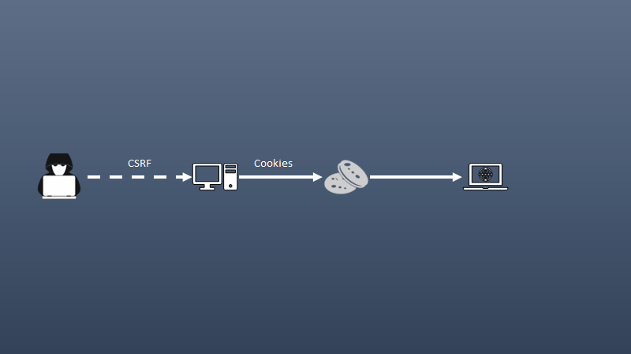

<p style="text-align:center;">
<a href="../../index.html">Back to Home</a> ♦ <a href="../../domain_one.html">Back to Domain One</a>
</p>

# Subdomain 1.3

_Given a scenario, analyze potential indicators associated with application attacks._

_Terms_: 24

***


#### Privilege escalation

* Gaining access to files you should not have permission to on a valid account via exploitation of a vulnerability.
* Usually access is of highest level and is of great concern.
* Can include horizontal privilege escalation where an attacker gets access to another credential on the network with higher privileges than the initial one used to gain their foothold.
* Make sure to patch software and OS as well as ensure anti-malware signatures are up to date. Also practice Data execution prevention.

#### Cross-site scripting (XSS)


* XSS is an injection vulnerability that occurs when an attacker can insert unauthorized JavaScript, VBScript, HTML, or other active content into a webpage.
* When other users view the page, the malicious code executes and affects or attacks the user.
* Malicious script can hijack the user's session, submit unauthorized transactions on the user's behalf, steal confidential information, or deface the page.
* Example:
  1. `https://fakewebsite.com/status?message=All+is+well`
  2. Application receives data in an HTTP request that includes data within the immediate response in an unsafe way. Response contains the following HTML code:
     
     ```html
     <p>Status: All is well.</p>
     ```
     
  3. An attack can craft a URL that includes malicious JavaScript code in the message parameter, which will be executed by the victim's browser when they visit the URL

#### Injections

_A process where an attacker supplies untrusted input to a program, which gets processed by an interpreter as part of a command or query._


##### Structured query language (SQL)

* Web security vulnerability that allows an attacker to interfere with the queries that an application makes to its database.
* Attacker injects malicious SQL code into the applications input fields, which can then be executed by the database.
* Can lead to unauthorized access to sensitive data, data loss, or even complete system compromise.
* Example:
  1. Suppose a web app uses an SQL database to store user info. The application has a login page that accepts a username and password. SQL query to authenticate the user might look like this:
     
     ```sql
     SELECT * FROM users WHERE username = 'username' AND password = 'password'
     ```
     
  2. An attacker can exploit this by entering the following string as the username:
     
     ```sql
     ' OR 1=1 --
     ```
  3. This will modify the SQL query to look like this:

     ```sql
     SELECT * FROM users WHERE username = ' ' OR 1=1 --' AND password = 'password'
     ```
     
  4. The `--` at the end of the string is used to comment out the rest of the original query. The modified query will return all rows from the `users` table, effectively bypassing authentication.
  
##### Dynamic-link library (DLL)

* A technique used for running code with the address space of another process by forcing it to load a dynamic-link library.
* DLL injection is often used by external programs to influence the behavior of another program in a way it's authors did not anticipate or intend.
* Example of a simple injection in C++:

  ```c++
  #include <windows.h>
  #include <stdio.h>

  int main(int argc, char **argv) {
    if (argc != 3) {
        printf("Usage: %s <PID> <DLL_PATH>\n", argv[0]);
        return 1; }

    DWORD pid = atoi(argv[1]);
    HANDLE hProcess = OpenProcess(PROCESS_ALL_ACCESS, FALSE, pid);
    if (!hProcess) {
        printf("Failed to open process %d\n", pid);
        return 1;
    }

    LPVOID lpRemoteString = VirtualAllocEx(hProcess, NULL, strlen(argv[2]) + 1, MEM_COMMIT, PAGE_READWRITE);
    if (!lpRemoteString) {
        printf("Failed to allocate memory in remote process\n");
        return 1;
    }

    if (!WriteProcessMemory(hProcess, lpRemoteString, argv[2], strlen(argv[2]) + 1, NULL)) {
        printf("Failed to write memory in remote process\n");
        return 1;
    }

    HMODULE hKernel32 = GetModuleHandle("kernel32.dll");
    FARPROC pLoadLibraryA = GetProcAddress(hKernel32, "LoadLibraryA");

    HANDLE hThread = CreateRemoteThread(hProcess, NULL, 0,
                                         (LPTHREAD_START_ROUTINE)pLoadLibraryA,
                                         lpRemoteString,
                                         0,
                                         NULL);
    if (!hThread) {
        printf("Failed to create remote thread\n");
        return 1;
    }

    WaitForSingleObject(hThread, INFINITE);

    VirtualFreeEx(hProcess, lpRemoteString, strlen(argv[2]) + 1, MEM_RELEASE);
    CloseHandle(hThread);
    CloseHandle(hProcess);

    return 0; }
  ```

##### Lightweight Directory Access Protocol (LDAP)

* A technique used to exploit web applications which could reveal sensitive information or modify information represented in the LDAP data stores.
* It exploits a vulnerability in an application by manipulating input parameters passed to internal search, add or modify functions.
* When an application fails to properly sanitize user input, it is possible for an attacker to modify a statement.
* Example:
  1. Suppose an application uses the following LDAP query to authenticate a user:

  ```ldap
  (&(uid=admin)(userPassword=pass))
  ```

  2. An attacker could inject malicious code into the query by entering the following string as the username:
 
  ```ldap
  *)(uid=*))(|(uid=*
  ```

  3. This would result in the following LDAP query:
 
  ```ldap
  (&(uid=*)(uid=*))(|(uid=*)(userPassword=pass))
  ```

  4. An attacker could then use this query to bypass authentication and gain access to sensitive data.

##### Extensible Markup Language (XML)

* A web security vulnerability that allows an attacker to manipulate or compromise the logic of an XML application or document.
* It occurs when user input is not properly validated or sanitized before being added to an XML document or query.
* As with other injection attacks, it is important to validate all input data and sanitize it before processing it. For XML it is recommended to disabled external entities in XML parsers and use whitelisting instead of blacklisting.

#### Pointer/object deference


* A pointer is a variable that stores memory addresses of another variable.
* A null pointer is a pointer that does not point to any memory location.
* A dangling pointer that points to a memory location that has been freed or deleted.
* An object reference is a reference to an object in memory.
* A null pointer reference occurs when the application dereferences a pointer that it expects to be valid, but is null, typically causing a crash or exit.
* Most null pointer issues result in general software reliability problems, but if an attacker can intentionally trigger a null pointer dereference, the attacker might be able to use the resulting exception to bypass security logic or to cause the app to reveal debugging information that will be valuable in planning subsequent attacks.
* Can also be used to cause a Denial of Service (DoS) attack.

#### Directory traversal

* Method of accessing unauthorized directories by moving through the directory structure on a remote server.
* This can be done by manipulating input parameters used by the application to access files and directories.
* Example URL that could be used in a directory traversal attack:

  `http://example.com/download.php?file=../../../etc/passwd`

  1. In this example, the attacker is trying to access the `etc/passwd` file, which is typically only accessible by the root user.
* To prevent these attacks, it is important to validate user input and sanitize file paths.

#### Buffer overflows

* Overwriting a buffer of memory that spills into other memory areas.
* Can lead to unpredictable behavior including crashes, data corruption, and even remote code execution.
* Example of a buffer overflow in C programming:

```C
#include <stdio.h>
#include <string.h>

int main(int argc, char **argv) {
    char buffer[16];
    strcpy(buffer, argv[1]);
    printf("Buffer contents: %s\n", buffer);
    return 0;
}
```
  1. In this example, the `strcpy` function is used to copy the contents of `argv[1]` into `buffer`. If `argv[1]` contains more than 16 characters, the excess characters will overwrite adjacent memory locations.
  2. This can be exploited by attackers to execute arbitrary code or crash the program.


#### Race conditions

* A situation that occurs when two or more threads or processes access shared data and try to modify it at the same time, leading to unexpected results.
* It is a common problem in multithread applications and multi-process systems.
* Suppose we have two threads, **Thread 1** and **Thread 2**, that are trying to access a shared variable **x**. **Thread 1** is responsible for setting the value of **x** to **10**, while **Thread 2** is responsible for printing the value of **x**. The following code snippet shows how this can be done:

```java
// Thread 1
x = 10;

// Thread 2
print(x);
```

  Assume that **Thread 2** starts executing before **Thread 1** and prints the value of **x** as **0**. This happens because the default value of an integer variable in Java is **0**, and **Thread 2** reads the value of **x** before it is set by **Thread 1**.
* To avoid race conditions, it is necessary to use synchronization mechanisms such as locks or semaphores to ensure that only one thread can access the shared data at any given time.

##### Time of check/time of use

* A type of software bug caused by a race condition involving the checking of the state of a part of a system and the use of the results of that check.
* This can happen when shared resources such as files, memory, or even variables in multithread programs
* The name "time of check to time-of-use" refers to the period between the time when a given resource is checked and the time that resource is used.
* A TOCTOU race condition occurs when between these two times, a change occurs in the resource to invalidate the results of the check.
* Weakness can be security relevant when an attacker can influence the state of the resource between check and use.
* Common in Unix systems, where they can be exploited to gain elevated privileges.

#### Error handling

* Dealing with errors that occur when the programs are running and communicating the response to the software developer and the user.
* Validate data (test for completeness, test for data type - valid data); don't allow system to crash; change color or textbox with errors.
* Improper error handling can lead to security vulnerabilities in applications and websites.
* For instance, error messages that provide clues about how an application or website operates can be used by attackers to break into secured areas.
* An example of error handling in JavaScript:

  ```js
  try {
    // Code that might throw an error
  } catch (error) {
    // Code to handle the error
  }
  ```

  The `try` block contains the code that might throw an error. If an error is thrown, the `catch` block will execute, and the `error` object will contain information about the error. You can then use this information to handle the error appropriately.

#### Improper input handling

* Invalid input that is accepted and used maliciously, causing attacks such as SQL injections, buffer overflows, denial of service, etc.
* Occurs when the software receives input or data, but it does not validate or incorrectly validates that the input has the properties are required to process the data safely and correctly. This can lead to parts of the system receiving unintended input.
* An example of this is when a web application exposes a function `showInfo()` that accepts parameters `name` and `template` from the user and opens a file based on this input. If the application does not validate the input properly, an attacker can craft the input in a form that is not expected by the rest of the application.

#### Replay attack


* An attack where an intruder records the communication between the user and a server, and later plays the recorded information back to impersonate the user. This is **NOT** an on-path attack as this does not require the original workstation.
* Network tap, ARP poisoning, malware are some of the methods used to achieve this.

##### Session replays

* When the client is first assigned to the server, the user is given a session ID (usually in the form of cookies.) Instead of constantly signing in, the user can access the server using the session ID
* If an attacker intercepts the session ID, then they will be able to log in as the client and access the server.

#### Integer overflow

* Is where a large number might be placed into a smaller section of memory - and that extra space needs to go somewhere - and usually it goes into an area of memory that is overflowed.
* This can lead to unexpected results, such as the program crashing (DoS) or producing incorrect output.
* For instance, in C programming, the `int` data type is typically used to store integers. The maximum value that can be stored in 32-bit `int` is 2,147,483,647. If you try to store a larger number than this in an `int`, an integer overflow will occur. For example, if you add at least 1 to the maximum value of an `int`, the result will be -2,147,483,648 instead of -2,147,483,648.

#### Request forgeries

_A type of malicious exploit of a website or web application where unauthorized commands are submitted from a user that the web application trusts. There are two types of request forgeries: cross-site request forgeries (CSRF) and server-side request forgeries (SSRF).

##### Server-side

* An attacker finds a vulnerable web application - generally caused by bad programming - and communicates to a web server and sends a request that controls a web application. The web server sends a request to another service, such as cloud file storage. Cloud storage sends response to the web server. Web server forwards response to the attacker.

##### Cross-site



* One-click attack, session riding (XSRF, CRSF(see surf)). Takes advantage of the trust that a web application has for a user.
* For instance, web site trusts your browser. Requests are made without your consent or your knowledge - attacker posts Facebook status on your account.

#### Application programming interface (API) attacks

* Attackers look for vulnerabilities in this new communication path - exposing sensitive data, DoS, intercepted communication, privileged access.
* For example, an attacker can launch am API injection attack by injecting malicious code into an application that does not follow secure coding practices. This can lead to unauthorized access to resources and data, such as SQL injection, JSON injection, and cross-site scripting (XSS).
* To prevent API attacks, it is important to implement security measures such as authentication and authorization mechanisms, rate limiting, and input validation.

#### Resource exhaustion

* Occurs when applications are allowed to operate in an unrestricted and unmonitored manner so that all available system resources are consumed in the attempt to serve the requests of valid users or in response to a DoS attack.
* Some examples would be a ZIP bomb, DHCP starvation.

#### Memory leak

* Memory which is allocated, but never deallocated (or freed) by the program
* Example of a memory leak in C:

```C
void g () {
  int* ptr = (int*)malloc(sizeof(int));
  ptr = (int*)malloc(sizeof(int));
  return;
}
```
  `g()` allocates the memory on the heap using `malloc`, but assigns a new value to `ptr` without freeing previously allocated memory. This means that every time `g()` is called, it will allocate more memory on the heap, leading to a memory leak.
* Memory leaks can occur in any programming language that allows dynamic allocation memory and it is important for programmers to be aware of this issue and take steps to avoid it.

#### Secure Sockets Layer (SSL) stripping


* An attack that combines an on-path attack with a downgrade attack in which the attacker sites in the middle of a conversation - must modify data between the victim and the web server acting as a proxy server or rogue Wi-Fi hotspot, using ARP spoofing, etc. The victim does not generally see any problem - except the browser page isn't encrypted. Removing the secure connection, traffic can be redirected, and instead of communicating to the web server the victim is communicating to the attacker.

#### Driver manipulation

_Security threats that involve altering system drivers to achieve a malicious outcome. Attackers can use shimming and refactoring to modify the behavior of an app, remove certain security features, bypass anti-virus or other security software, or hide the presence of malware._

##### Shimming

* Type of attack that targets a system's security measures.
* It is a form of malicious software designed to bypass security measures and gain access to the system.
* It works by inserting malicious code into a legitimate process or application.

##### Refactoring

* The process of restructuring existing code without changing its behavior. It is a way to improve the design, structure and implementation of software.
* Can also be used to help find bugs or vulnerabilities hidden in their software.

#### Pass the hash


* Victim sends credentials to the server and during this attack intercepts (via ARP poisoning or some other form of redirection) the credentials on the network for the username and hashed password.
* They can now pretend to be the original user by sending those hashed credentials and pass those credentials to the server as if it were doing this from the original client.
* From the prospect of the server, this looks like normal authentication from a legitimate user and means that the attack would have access to that user's account on the server.

***

# Demonstrate Your Understanding

<p style="text-align:center;">
<a href="#top">Back to Top</a> ♦ <a href="../../resources/study_cards/sub_one_three.html" target="_blank">Study in a New Tab</a></p>

_Click or tap on 'Choose a Study Mode' to switch between flash cards, match, learn, test and more._

<iframe src="https://quizlet.com/815016617/flashcards/embed?i=35mna1&x=1jj1" height="500" width="100%" style="border:0"></iframe>