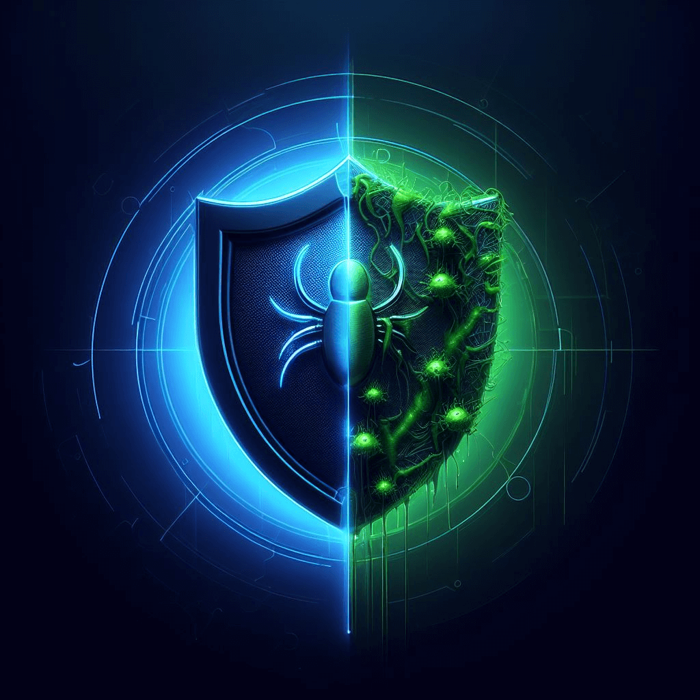
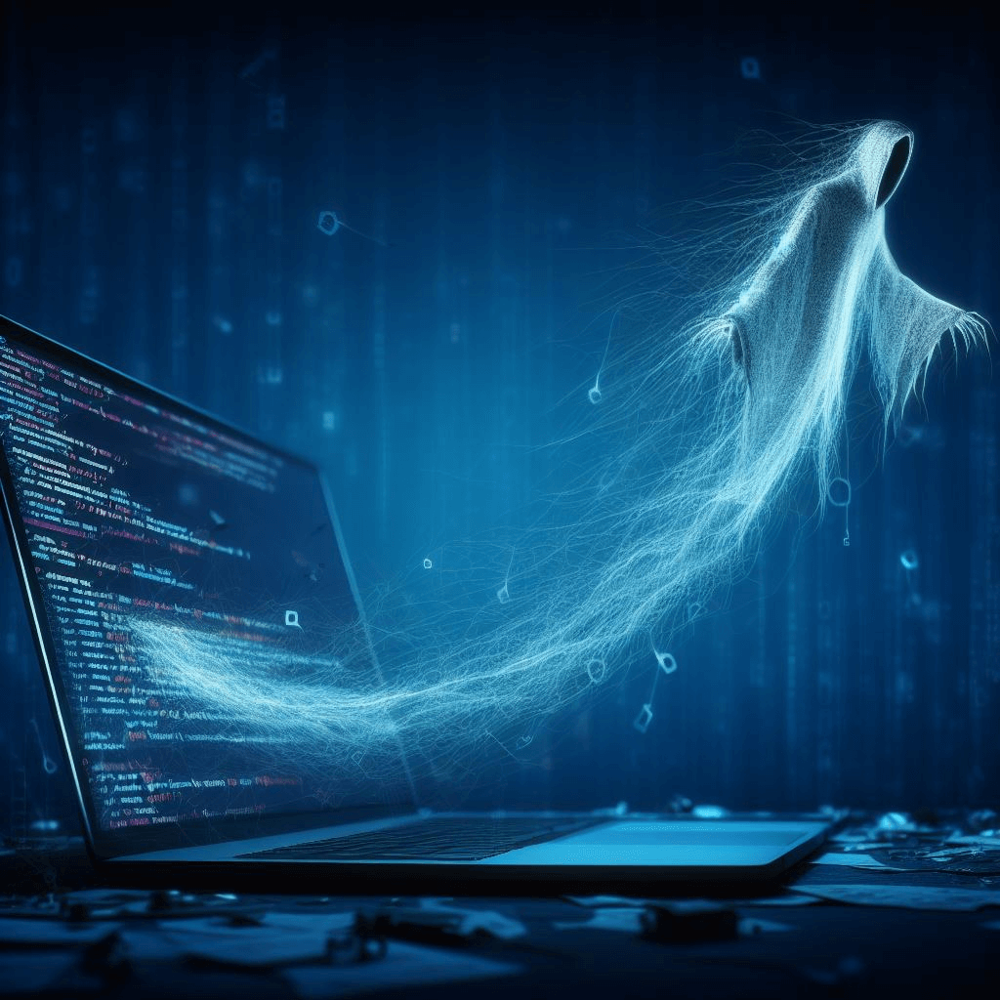
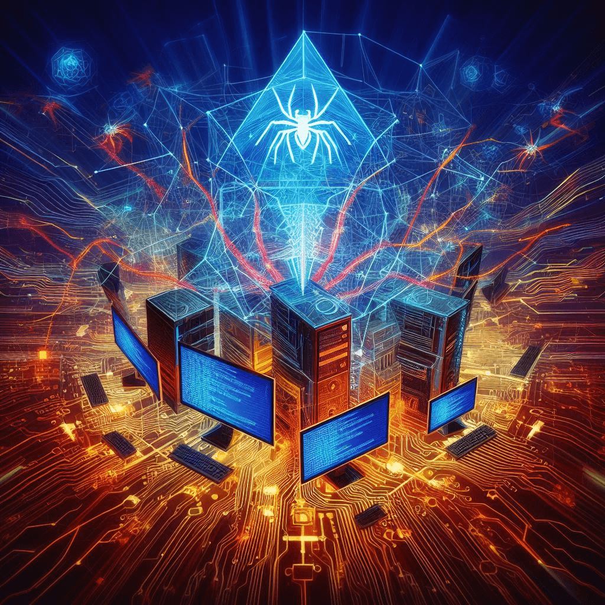
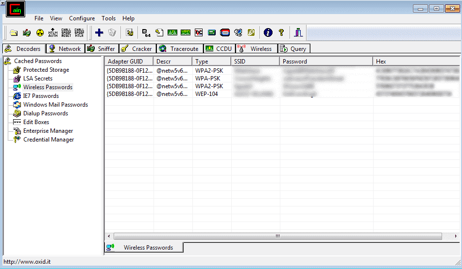

[Back to Home](../../index.html) \| [Back to Domain One](../domain_one.html)

# Subdomain 1.2

_Given a scenario, analyze potential indicators to determine the type of attack._

_Terms_: 34

***

#### Malware
_Malicious software. Intended to damage or disable computers and computer systems._

##### Ransomware

* Type of malware that is designed to block access to a computer system until a sum of money is paid.
* Can spread through phishing email or unknowingly/knowingly infected website.
* May or may not be able to be removed by a security professional without paying the sum of money to the attacker.
* Protect against this threat by keeping backups of your computer, keeping your OS and software patched and up-to-date, and keeping anti-malware signatures up to date.

##### Trojans

* A type of malware that pretends to be a useful program while secretly performing another function.
* Users may download and install what they believe to be legitimate software without realizing that a Trojan horse will also be installed.
* Circumvents existing security - some may even be built to disable anti-virus software.
* To protect against this threat, don't run unknown software, keep anti-malware signatures up-to-date, and keep backups!

##### Worms

* A self-replicating program or algorithm that consumes system resources and can spread through networks, emails, and messages.
* This form of malware can take over many systems quickly.
* Firewalls and IDS/IPOS can mitigate infestations but can't help much once the worm is on the inside.

1. Infected computer searches for a vulnerable system.
2. Vulnerable computer is exploited.
3. Backdoor is installed and downloads worm.

##### Potentially unwanted Programs (PUPs)

* A form of software that is often unsuspectingly installed with other software and is normally undesirable.
* Examples of this would be an overly aggressive browser toolbar, a backup utility that displays ads, or a browser search engine hijacker.

##### Fileless virus

* A virus that does not save as a file on the computer directly; instead, it operates in memory and is never installed.

Example:
1. User clicks on malicious website link.
2. Website exploits a flash/Java/Windows vulnerability.
3. Launches PowerShell and downloads payload in RAM.
4. Runs scripts and executables in memory, exfiltrates data, damages files.
5. Adds an auto-start to registry.

##### Command and control

* A server or computer controlled by an attacker or cybercriminal which is used to send commands to systems compromised by malware and receive stolen data from a target network.
* Many campaigns have been found using cloud-based services, such as webmail and file-sharing service - allows C&C servers to blend in with normal traffic and avoid detection.
* Also serve as the headquarters for compromised machines in a botnet.

##### Bots

* A bot, short for robot, is a type of software application or script that performs automated tasks on command.
* Bots generally perform malicious tasks that allow an attacker to remotely take control over an affected computer.
* Are generally part of a larger entity called a botnet and controlled through a Command and Control server or C&C.

##### Botnet*

* A botnet, short for robot network, is a group of compromised computers or mobile devices connected to a network and managed using a C&C server.
* As they infect newer technologies such as Internet of Things (IoT) devices in homes, public spaces, and secure areas, even more unsuspecting users can be put at risk. This is due to the lack of security on these open-source and generally unprotected devices.
* Compromised devices within a botnet can be controlled to perform a variety of actions, not limited to Distributed Denial of Service (DDoS) attacks, relay spam, proxy network traffic, and other distributed computing tasks.

##### Cryptomalware

* A newer generation of ransomware.
* Where malware encrypts your data files (pictures, documents, movies, music, etc.) Your OS remains available as they want you running, but not working.
* Pay a ransom and your data will be returned.

##### Logic bombs

* Malicious code objects that infect a system and lie dormant until they are triggered by the occurrence of one or more conditions such as time, program launch, website logon, and so on.
* Difficult to identify and difficult to recover if it goes off.

##### Spyware

* A software application that is secretly placed on a user's system to gather information and relay it to outside parties (host machine).
* They are generally difficult to recognize as each is unique and does not have a predefined signature.
* Can be prevented through process and procedures, electronic monitoring such as host-based intrusion detection, and constant monitoring from administrators.

##### Keyloggers

* Malware that capture keystrokes from keyboards.
* Keylogger applications may also capture other input like mouse movement, touchscreen inputs, or credit card swipes from attached devices.

##### Remote Access Trojan (RAT)

 

* Provides the attacker with remote control of a victim computer and is the most commonly used type of Trojan.
* A remote administration tool; the ultimate backdoor.
* Attacker connects with client software and and then controls the device for keylogging, screen recording or collecting screenshots, copy files, or embed even more malware.
* Don't install unknown software, keep anti-malware signatures updated, and always backup!

##### Rootkit

* A set of software tools that enable an unauthorized user to gain control of a computer without being detected.
* Modifies the core system files; invisible to the OS and traditional anti-virus utilities.
* Make sure to look for the unusual and perform anti-malware scans. Use a remover specific to the rootkit which are normally built after the rootkit is discovered. Secure boot with UEFI which is additional security embedded in the BIOS.

##### Backdoor

* Gives access to a computer, program, or service that circumvents normal security to give program access.
* Often placed on a computer through malware.
* Some software include a backdoor; bad software can have a backdoor as part of the app.

#### Password attacks

_Malicious ways hackers attempt to gain access to an account. A common attack vector used to bypass or exploit authentication of user accounts. Include several different techniques._

##### Spraying

* Attack an account with the top three (or more) common passwords - if they don't work, move on to the next account.
* No lockouts, no alarms, no alerts.
* Can be found commonly where the application or admin sets a default password for new users.

##### Dictionary

* An attack that compares passwords against common words in a dictionary of words - usually from wordlists that can be found on the internet.
* They can take quite a bit of time but can go on to find the hashes associated with the cracked passwords using this attack.
* Password crackers can substitute letters for numbers or symbols (i.e. pa$$w0rd.)
* Example software: [Cain and Abel](https://en.wikipedia.org/wiki/Cain_and_Abel_(software))

##### Brute force

* This type of attack sees the threat actor try every possible password combination until a hash is matched.
* This might take some time - a strong hashing algorithm can slow things down.
* Online: keep trying the login process; very slow as most accounts will lockout after a number of failed attempts.
* Offline: Obtain a list of users and hashes; calculate a password hash, compare to a stored hash. Large computational resource requirement.

##### Rainbow table

* Lists of common passwords and the value they hash to.
* An optimized, pre-built set of hashes that saves time and storage space and contains pre-calculated hash chains.
* Has a remarkable speed increase, especially with longer password lengths.

_Example of a rainbow table using MD5 hash._

  | hash_hash                        | hash_id | hash_word |
  |:---------------------------------|:--------|:----------|
  | 0cc175b9c0f1b6a831c399e269772661 | 1       | a         |
  | 92eb5ffee6ae2fec3ad71c777531578f | 2       | b         |
  | 4a8a08f09d37b73795649038408b5f33 | 3       | c         |
  | ...                              | ...     | ...       |
  | 02129bb861061d1a052c592e2dc6b383 | 50      | X         |
  | 57cec4137b614c87cb4e24a3d003a3e0 | 51      | Y         |
  | 21c2e59531c8710156d34a3c30ac81d5 | 52      | Z         |
  

##### Plaintext/unencrypted

* A rare scenario when a threat actor is able to locate passwords stored "in the clear" - no encryption.
* If an application is seen storing passwords as plaintext - get rid of this application!

##### _Note: Regarding Hash and Salt_

See [subdomain 2.8](https://jhumphreys.github.io/security_plus/domains/domain_two.html#subdomain-28)

#### Physical attacks

_A type of security attack that involves the use of physical devices to gain authorized access to a system or network. Can be in many forms, including malicious USB cables, flash drives, skimming, and card cloning._

##### Malicious Universal Serial Bus (USB) cable

* Physical attack where a seemingly harmless USB cable has additional electronics inside to pose as a keyboard/mouse or other Human Interface Device (HID)
* Once connected, the cable takes over and installs malicious software.
* Can be prevented by only using trusted hardware.

##### Malicious flash drive

* Physical attack where a flash drive is loaded with malicious files (MS Office docs, PDF files) and documents or acts as a HID (Human Interface Device) or another device such as an Ethernet adapter in order to hijack information.
* Older operating systems would just run the drive automatically - this is no longer the case.
* Can be prevented by only using trusted flash drives.

##### Card cloning

* Physical attack where card details are compromised and placed on a duplicate card, often included with the printed CVC (Card Validation Code).
* The card magnetic stripe is duplicated but the chip cannot be cloned.
* Card details are generally cloned by a skimmer.
* Cloning gift cards are common as they use magnetic stripe technology.

##### Skimming

* Physical attack where a device is installed over hardware that reads credit or debit cards and captures the information from the cards magnetic swipe - card number, expiration date, card holder's name.
* May also be used in conjunction with a camera to record PIN information.
* Always physically check before using card readers or ATM terminals.

#### Adversarial artificial intelligence (AI)

* Machine learning: Computers identify patterns in data which in turn further improve their predictions. This requires an ample and continuous quantity of training data. It's in use everyday in a variety of products including email (anti-spam), websites (recommend products), and prevent car accidents (automatic breaks, self-driving).
* Poisoning of the training data: Confuse AI. Attackers can feed the AI modified training data to cause it to behave incorrectly.
* Evasion attacks: AI only as good as training data and attackers will find holes and limitations. AI that may be trained to fight spam may have an attacker try words that the AI does not treat as bad and allow through.
* Secure: Check and crosscheck training data. Constantly retrain the AI with new data, more data. Train the AI with the poisoned data - let the AI know what it is up against.

##### Tainted training data for machine learning (ML)

* When attackers send modifying training data that causes the AI to behave incorrectly - confuse the artificial intelligence.

##### Security of machine learning algorithms

* Actions to take to constantly retrain, cross check, and verify AI training data with new data, more data, and better data to prevent AI poisoning.
* It may also be plausible to train the AI with possible poisoning data so the AI knows what to look out for.

#### Supply-chain attacks

* Attacks that focus on weaker links in an organization's supply chain.
* An attacker will find an exploit to infect the entire chain through a third-party supplier.
* People trust their suppliers...

#### Cloud-based vs. on-premises attacks

* Attackers want data no matter where it is.
* When it comes to cloud-based security, it is centralized and can cost less as it requires no dedicated hardware or data center to secure - a third-party handles that.
* With on-premises, the security burden is placed on the client and requires data center security and infrastructure costs.

#### Cryptographic attacks

_You now have encrypted the data and sent it to another person - is it secure? These attacks focus on finding ways to undo security and locate cryptographic shortcomings._

##### Birthday

* This attack will generate multiple versions of plaintext to match the hashes and find collision through brute force.
* Exploits the mathematics behind the [birthday problem in probability theory](https://en.wikipedia.org/wiki/Birthday_attack). This problem asks for the probability that, in a set of _n_ randomly chosen people, at least two will share a birthday.
* You can help protect yourself by using a large hash output size. 🧂

##### Collision

* Hash digests are _supposed_ to be unique, and different input data should never create the same hash.
* However, with previous hashing algorithms there is a cryptographic attack that exploits collisions in these hashes.
* Example: [SHAttered attack](https://debugpointer.com/security/collision-attack#:~:text=Perhaps%20one%20of%20the%20most%20well-known%20examples%20of,expedited%20the%20move%20towards%20more%20secure%20hash%20functions.). Researchers were able to find a collision in the SHA-1 hash function. This quickly led to an expedited move towards more secure hash functions.

##### Downgrade

* An attack that forces a system to rollback it's security in order to carry out an exploit.
* An [example of this flaw was](https://en.wikipedia.org/wiki/Downgrade_attack) found in OpenSSL that allowed the attacker to negotiate down to a lower version of TLS between the client and server. This is the is on of the most common types of downgrade attacks.

***

# Demonstrate Your Understanding

[Back to Top](#top) \| [Study in a New Tab](../../resources/study_cards/sub_one_two.html){:target="_blank"}

_Click or tap on 'Choose a Study Mode' to switch between flash cards, match, learn, test and more._

<iframe src="https://quizlet.com/814378060/flashcards/embed?i=35mna1&x=1jj1" height="500" width="100%" style="border:0"></iframe>