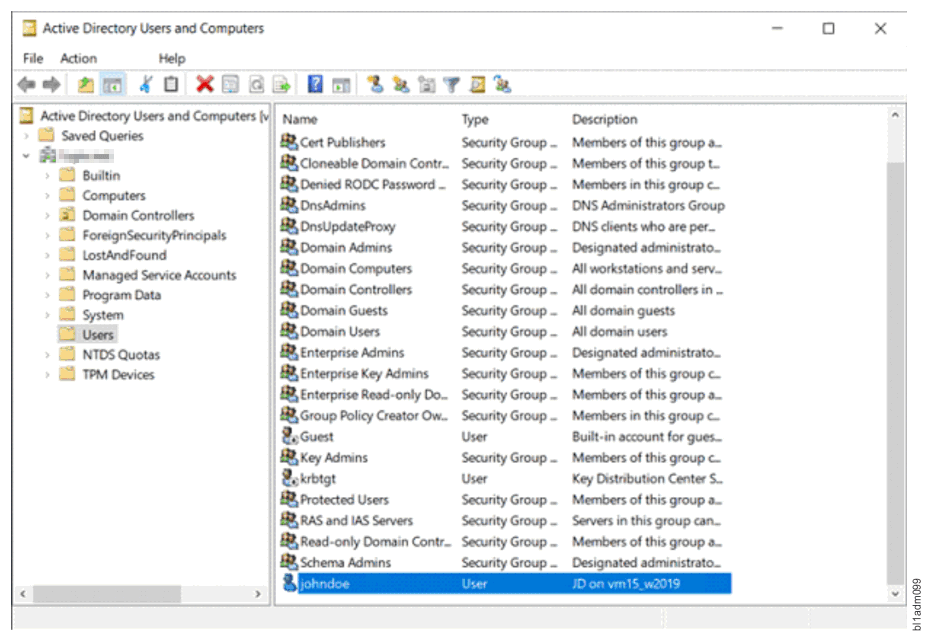
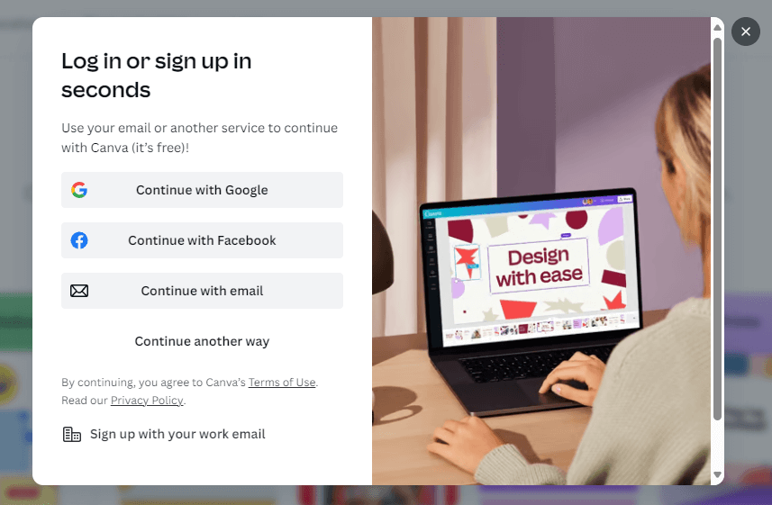

[Back to Home](../../index.html) \| [Back to Domain Two](../domain_two.html)

# Subdomain 2.4

_Summarize authentication and authorization design concepts._

_Terms_: 35

***

#### Authentication Methods

_The process of verifying the identity of a user, device, or system. It is a crucial component of information security that helps prevent unauthorized access to sensitive data and resources._

##### Directory Services

* Keeps all of an organization's usernames and passwords into a single database - also contains computers, printers, and other devices.
* Think [Active Directory](https://learn.microsoft.com/en-us/windows-server/identity/ad-ds/get-started/virtual-dc/active-directory-domain-services-overview).
* Large distributed database that is constantly replicated.
* All authentication requests reference this directory. Each user only needs one set of credentials. One username and password for all services.
* Access via Kerberos or LDAP.

##### Federation

* Provide network access to others. Not just employees - Partners, suppliers, customers, etc. Provides SSO and more.
* [Third-parties](https://auth0.com/) are able to establish a federated network. Authenticate and authorize between the two organizations.
* Login with your [Facebook](https://learn.microsoft.com/en-us/entra/external-id/facebook-federation) credentials.
* The third-parties must establish a trust relationship and the degree of the trust.

##### Attestation

* Prove the hardware is really yours - a system that you can trust.
* Easy when it is just your computer - more difficult when there are 1,000.
* Remote attestation:
     - Device provides an operational report to a verification server.
     - Encrypted and digitally signed with the TPM.
     - An IMEI or other unique hardware component can be included in the report.

##### Technologies

_During the authentication process, we use many different technologies such as TOTP, HOTP, SMS, static codes, push notifications and more._

###### Time-Based One-Time Password (TOTP)

* Use a secret key and the time of day - no incremental counter.
* Secret key is configured ahead of time - timestamps are synchronized via NTP.
* Timestamp usually increments every 30 seconds - put in your username, password, and TOTP code.
* One of the more common OTP methods - used by Google, Facebook, Microsoft, etc.

###### HMAC-Based One-Time Password (HOTP)

* Use them once, and then never again - once a session, once each authentication attempt.
* Keyed-hash message authentication code (HMAC). The keys are based on a secret key and a counter.
* Token-based authentication - the hash is different every time.
* Hardware and software tokens available. You will need additional technology to make this work.

###### Short Message Service (SMS)

* Text messaging.
* Login factors can be sent via SMS to a predefined phone number. Provide username and password. Phone number receives an SMS. Input the SMS code into the login form.
* Security issues do exist, such as phone number can be reassigned to a different phone. SMS messages can also be intercepted.

###### Token Key

* A unique code or number that is used in addition to or in place of a password.
* It acts like an electronic key to access something. 
* For example, can be used to open a locked door or a bank-provided token can be used by a customer to access their bank account online.

###### Static Codes

* Authentication factors that do not change.
* Personal Identification Number (PIN).
* Can also be alphanumeric - a password or passphrase.

###### Authentication Applications

* Pseudo-random token generators that can be accessed from a device such as a mobile phone.
* Software-based.

###### Push Notifications

* Similar to SMS but the authentication factor is pushed through a specialized application to the phone.
* Does have security challenges as apps themselves can be vulnerable and some apps push notifications are sent in the clear instead of redirecting the user back to the app to obtain the auth. factor.

###### Phone Call

* A voice call that provides a token to the user, "Your code is 1-8-6-2-5."
* Also has similar disadvantages to SMS as phone call can be intercepted or forwarded and phone number can be added to another phone.

##### Smart Card Authentication

* An integrated circuit card which can be contacted or contactless and commonly used in credit cards.
* Must have a physical card in order to provide digital access - a digital certificate.
* Usually includes multiple factors such as using the card with a PIN or fingerprint scan.

#### Biometrics

_"Life measurement" used for security purposes._
* Examples:
      - Iris scans, voice, analysis, fingerprinting.

##### Fingerprint

* Used on laptops, phones, or on door access.
* Registers a fingerprint scan of the user.

##### Retina

* Unique capillary structure in the back of the eye is registered and then used as authentication.

##### Iris

* Texture or color of eye is recorded as an authentication factor.

##### Facial

* Shape of the face and features are recorded as an authentication factor.

##### Voice

* Talk for access.

##### Vein

* Vascular scanners; match the blood vessels that are visible from the surface of the skin.

##### Gait Analysis

* Identify a person based on how they walk.

##### Efficacy Rates

* Measured by two metrics: false acceptance rate (FAR) and false rejection rate (FRR). Biometric authentication is not a perfect science and has its limitation.

##### False Acceptance

* A biometric measurement of the percentage of valid users that will be falsely accepted by the system. This is called a type II error.
* Type II errors are more dangerous than type I errors. Not sensitive enough.

##### False Rejection

* A biometric measurement of valid users that will be falsely rejected by the system. This is called a type I error. Too sensitive

##### Crossover Error Rate

* CER
* Defines the overall accuracy of a biometric system.

#### Multifactor Authentication (MFA) Factors and Attributes

* MFA
* Three primary factors of authentication is something you know, something you have, and something you are.
* In addition to these factors, there are attributes that can be used to further enhance the security of MFA.
* These include something you do, something you are, and someone you know.

##### Factors

_Something you know, something you have, something you are._

###### Something You Know

* This factor requires the user to prove knowledge of a secret - such as a password, PIN, or security question.

###### Something You Have

* This factor requires the user to prove possession of a physical object, such as a smart card, USB key, or mobile phone.

###### Something You Are

* This factor requires the user to prove their identity through a unique biological characteristic, such as a fingerprint, iris scan, or facial recognition.

##### Attributes

_Something you are, something you can do, something you can exhibit, someone you know._

###### Somewhere You Are

* This attribute refers to the location of the user and can be determined using GPS or IP address.

###### Something You Can Do

* This attribute refers to the user's abilities or skills and can include typing speed, mouse movements, or voice recognition.

###### Something You Exhibit

* A unique trait that is personal to you.
* This could be a gait analysis - the way you walk.
* This could be a typing analysis - the way you hit the enter key too hard on your keyboard.

###### Someone You Know

* This attribute refers to the user's social network and can include contacts in their phonebook or friends on social media.

#### Authentication, Authorization, and Accounting (AAA)

* A framework that is used to provide security services for network access. It is a three-step process:
      - Authentication: Process of verifying the identity of a user or device attempting to access the network.
      - Authorization: After authentication. This process determines what resources the user or device is allowed to access on the network.
      - Accounting: Final process. Used to track and record what resources were accessed by whom and when. This information can be used for auditing purposes or to detect security breaches.
* _MFA is a common practice of AAA - uses multiple authentication factors to authenticate users and provides an additional layer of security.

#### Cloud Vs. On-Premises Requirements

* Cloud-based authentication and authorization requirements include centralized security, lower cost, and third-party IT services.
* On-prem authentication and authorization requirements include complete control over the facility, users, and support team, as well as the ability to hire exactly the right people to make sure that all of your data is secure.
* It is important to note that attackers do not care about where your data is located - you just have to be sure that it is secure no matter where it is stored.

***

# Demonstrate Your Understanding

[Back to Top](#top) \| [Study in a New Tab](../../resources/study_cards/sub_two_four.html){:target="_blank"}

_Click or tap on 'Choose a Study Mode' to switch between flash cards, match, learn, test and more._

<iframe src="https://quizlet.com/845859226/flashcards/embed?i=35mna1&x=1jj1" height="500" width="100%" style="border:0"></iframe>