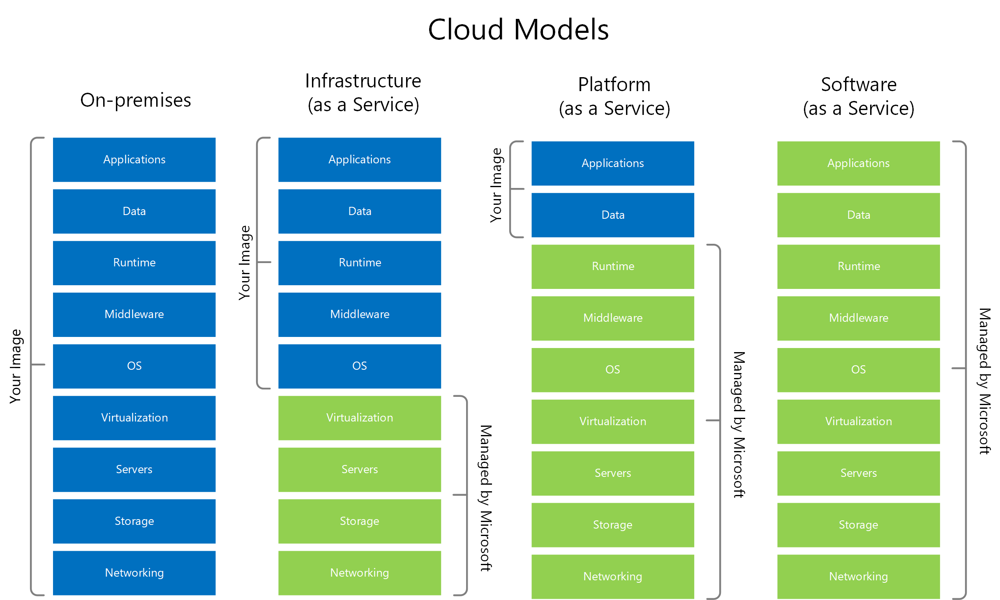

[Back to Home](../../index.html) \| [Back to Domain Two](../domain_two.html)

# Subdomain 2.2

_Summarize virtualization and cloud computing concepts._

_Terms_: 28

***

#### Cloud Models

* A popular technology that allows users to access computing resources over the internet.
* Cloud-based infrastructure can take many different forms with some of the most common being private, public and hybrid cloud, Infrastructure as a Service, Software as a Service, and Platform as a Service.

_Image courtesy of Microsoft._

##### Infrastructure as a Service (IaaS)

* Sometimes called Hardware as a Service (HaaS). Virtually outsourcing your equipment.
* You're responsible for the management and security.
* Your data is out there, but more within your control.
* Web server providers.

##### Platform as a Service (PaaS)

* No servers, no software, no maintenance team, no HVAC...
* Someone else handles the platform while you handle the development.
* You don't have direct control of the data, people, or infrastructure. Trained security professionals are watching your stuff.
* Put the building blocks together and develop your app from what is available on the platform.
* Example: Salesforce.com

##### Software as a Service (SaaS)

* On-demand software with no local installation. No need to manage your own email distribution or payroll software.
* Central management of data and apps.
* A complete application offering with no development work required.
* Examples: Gmail, Microsoft Office 365.

##### Anything as a Service (XaaS)

* A broad description of all cloud models. Use any combination of the cloud.
* Services delivered over the internet - not locally hosted or managed.
* Flexible consumption model with no large upfront costs or ongoing licensing.
* IT becomes more of an operating model and less of a cost-center model. Any IT function can be changed into a service.

##### Public

* Services available to everyone over the internet from third-party companies.

##### Community

* Shared cloud resources between organizations and shared concerns.

##### Private

* Set up for specific organizations.
* They pay the cloud provider to have the equipment running their cloud on segregated infrastructure - possibly for compliance reasons.

##### Hybrid

* Combination of private and public clouds.
* For instance, could host a database on an on-prem cloud but backup the data to an off-prem cloud from a cloud provider.

#### Cloud Service Providers (CSPs)

* Provider cloud services such as SaaS, PaaS, IaaS, etc.
* Impose a usage-based or flat cost. Cost increases with increased data.
* You are still in charge of your internal personnel, development teams, and operational support.

#### Managed Service Provider (MSP) / Managed Security Service Provider (MSSP)

* Managed Service Provider (MSP):
     - Also a cloud service provider. However, not all cloud service providers are MSPs.
     - MSP support can include network connectivity management, backups and disaster recovery, and growth management and planning.
* Managed Security Service Provider (MSSP):
     - Provides firewall management, patch management, security audits, emergency response and more.

#### On-Prem vs Off-Prem 

* On-Prem:
     - Your apps are on your local hardware and your servers are in your own data center within your own building.
* Off-Prem:
     - Usually a specialized computing environment.
     - There are not any servers in your building. It's possible that they aren't even using your hardware.

#### Fog Computing

* A cloud that is close to your data. Cloud + IoT - Fog computing.
* A distributed cloud architecture which extends the cloud.
* Distribute the data and processing:
     - No latency because immediate data stays local.
     - Local decisions made from local data.
     - No bandwidth requirements.
     - Private data never leaves which minimizes security concerns.
     - Long-term analysis can occur in the cloud - internet only when required.

#### Edge Computing

* Process application data on an edge server where it is close to the user.
* Often process data on the device itself:
     - No latency, no network requirement.
     - Increased performance and speed.
     - Process where data is instead of processing in the cloud.

#### Thin Client

* Basic appliance:
     - Apps actually running on a remote server.
     - Virtual Desktop Infrastructure (VDI) or Desktop as a Service (DaaS).
     - Local device is a keyboard, mouse and screen.
* Does not use much CPU or memory, minimal OS on the client.
* Network connectivity - BIG network requirement. Everything happens across the wire.

#### Containers

* Has all the components required to run an application. Code and dependencies. A standard unit of software.
* Isolated process in a sandbox. Self-contained, apps can't interact with each other.
* Container image is a standard for portability. Lightweight and uses the host kernel. Secure separation between applications.

#### Microservices/API

* Monolithic apps with on big application that does everything.
* App contains all decision making processes such as user interface, business logic and data input and output.
* There are code challenges such as large codebases and change control challenges.
* API is the "glue" to microservices and works together to act as the application.
* Scalable - only scale the microservices you need.
* Is resilient and outages are contained.
* Containment is built-in for security and compliance.

#### Infrastructure as Code (IaS)

* Use code to describe an infrastructure - define servers, network, and apps as code.
* Modify infrastructure and create versions similar to versioning app code - version control through Git or other Version Control System (VCS).
* Reuse code to build other app instances.
* An important concept for cloud computing - you can essentially build a perfect resource every time.

##### Software-Defined Networking (SDN)

* Networking devices have two planes of operation: control plane and data plane.
* Is agile meaning changes can be made dynamically.
* Is centrally managed for a global view - a single pane of glass.
* Programmatically configured with no human intervention.
* Open standards and vendor neutral - a standard interface to the network.

##### Software-Defined Visibility (SDV)

* In order to react and respond, you need to see the traffic to secure the data.
* Dynamic deployments include security and network visibility devices. Next-generation firewalls, web application firewalls, Security Information and Event Management (SIEM).
* Data encapsulated and encrypted with VXLAN and SSL/TLS.
* New technologies such as IaC and microservices change what you can see.
* Security devices monitor app traffic - SDV provides visibility to traffic flows.
* App flows can be controlled via API - identify and react to threats.
* Visibility expands as the app instances expand with real-time metrics across all traffic flows.

#### Serverless Architecture 

* Function as a Service (FaaS) where apps are separated into individual, autonomous functions.
* Remove the operating system from the equation.
* Developers still create server-side logic, it is just running in a stateless compute container.
* Could be event triggered and ephemeral, and may only run for one single event.
* Generally managed by a third party - OS security concerns are accepted by the third party.

#### Services Integration 

* Service Integration and Management (SIAM).
* Many different service providers - the natural result of multisourcing.
* Every provider works differently - different tools and processes.
* SIAM is the integration of these diverse providers. Provide a single business-facing IT organization.
* An evolving set of processes and procedures.

#### Resource Policies

* Assigning permissions to cloud resources. Not the easiest task as everything is in constant motion.
* Specify which resources can be provisioned (Azure) - create a service in a specific region and deny all others.
* Specify the resource and what actions are permitted (Amazon) - allow access to an API gateway from an IP address range.
* Explicitly list the users who can access the resource (Amazon) - user list is associated with the resource.

#### Transit Gateway

* Virtual Private Cloud (VPC) - a pool of resources created in a public cloud.
* Common to create many VPCs - many different app clouds.
* Connect VPCs with a transit gateway and users to VPCs - a "cloud router".
* Make it secure - VPCs are commonly on different IP subnets, connecting to the cloud is often through a VPN.

#### Virtualization

* Utilize the same hardware to run any operating system.
* Every instance of an application has its own operating system, which increases complexity and overhead.
* Virtualization can be relatively expensive.

##### Virtual Machine (VM) Sprawl Avoidance

* Due to the ease of building instances, large organizations can start to generate to many VMs which can get out of hand quickly.
* Due to these VMs being _sprawled_ everywhere, you aren't sure which VMs are related to which applications. It becomes extremely difficult to deprovision.
* Formal process and detailed documentation - you should have information on every virtual object.

##### VM Escape Protection

* Break out of the VM and interact with the host operating system or software.
* Once you can escape the VM, you have great control. Control over the host and control other guest VMs.

***

# Demonstrate Your Understanding

[Back to Top](#top) \| [Study in a New Tab](../../resources/study_cards/sub_two_two.html){:target="_blank"}

_Click or tap on 'Choose a Study Mode' to switch between flash cards, match, learn, test and more._

<iframe src="https://quizlet.com/845139638/flashcards/embed?i=35mna1&x=1jj1" height="500" width="100%" style="border:0"></iframe>